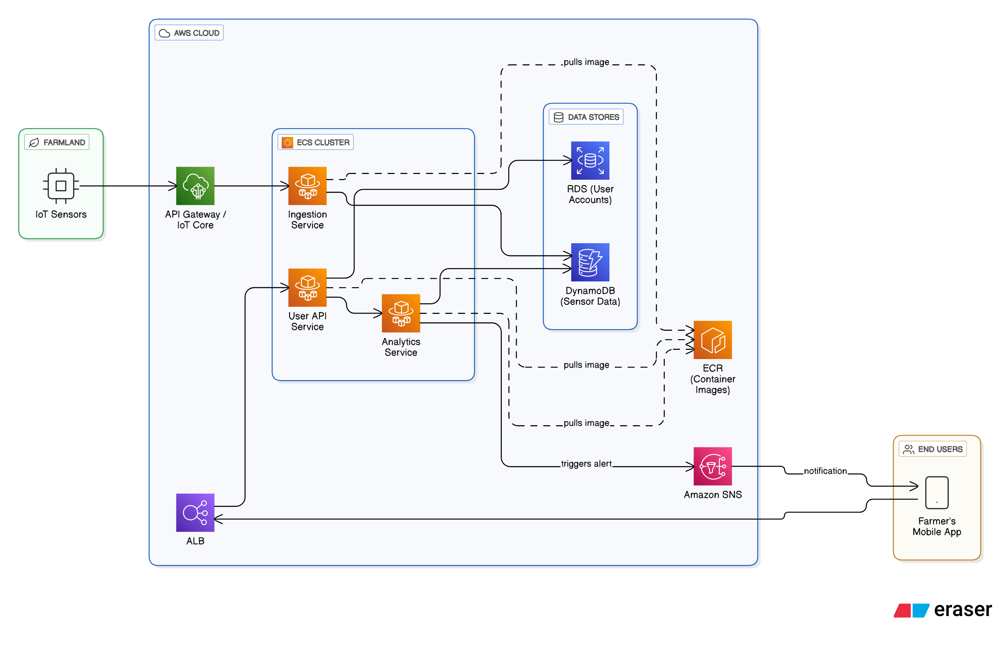

# UNIVERSITI TEKNOLOGI PETRONAS

## FINAL EXAMINATION

### MAY 2024 SEMESTER

**COURSE:** TEB3033 - DISTRIBUTED AND PARALLEL COMPUTING
**DATE:** 13 AUGUST 2024 (TUESDAY)
**TIME:** 2:30 PM - 5:30 PM (3 HOURS)

---

### INSTRUCTIONS TO CANDIDATES

1.  Answer ALL questions in the Answer Booklet.
2.  Begin EACH answer on a new page in the Answer Booklet.
3.  Indicate clearly answers that are cancelled, if any.
4.  Where applicable, show clearly steps taken in arriving at the solutions and indicate ALL assumptions, if any.
5.  DO NOT open this Question Booklet until instructed.

**Note**
i. There are ELEVEN (11) pages in this Question Booklet including the cover page
ii. DOUBLE-SIDED Question Booklet.

---

### TEB3033

#### 1. Cloud Migration for MediHealth Corp

You are a distributed systems engineer at MediHealth Corp, a company specializing in healthcare solutions. Your company offers a range of services for such customers as healthcare providers, doctors and patients. Currently, these services are operated on-premises. Your company has decided to migrate its infrastructure to the cloud. As part of this transition, MediHealth Corp is adopting the Cloud Adoption Framework (CAF) to guide its migration strategy. Your task is to ensure seamless transition from on-prem to the cloud and determine the best cloud service models for the various components of your system.

Some of the components of the system are as follows:

- **Electronic Health Records (EHR) Management:** Manages patient medical records and related data.
- **Telemedicine Platform:** Facilitates virtual consultations between patients and healthcare providers.
- **Health Analytics:** Collects and analyzes patient data to provide insights and improve healthcare services.
- **Patient Recommendation System:** Provides personalized health recommendations to patients based on their medical history and current health data.
- **Email and Collaboration Tools:** Used by your internal team for communication and project management.

Based on the scenario, answer the following questions:

**a.** Identify the best cloud service model for the Electronic Health Record (EHR) Management, given the requirement to host on dedicated compute machines for compliance, customizability, and control over the environment. Justify your answer.
[4 marks]

**Answer:**

The best cloud service model for the Electronic Health Record (EHR) Management is **Infrastructure as a Service (IaaS)**.

**Justification:**

- **Control and Customizability:** The scenario specifies requirements for dedicated compute machines, customizability, and full control over the environment. IaaS provides virtual machines (like Amazon EC2 instances) where MediHealth Corp has complete control over the guest operating system, including patching, maintenance, and the installation of custom software required for the EHR system. This aligns with the "Customer responsibilities" for IaaS outlined in the Shared Responsibility Model, which include managing the instance operating system and security group configurations.
- **Compliance:** Healthcare data is subject to strict compliance regulations (like HIPAA). IaaS allows the company to configure the environment precisely to meet these standards. Using options like Amazon EC2 Dedicated Hosts provides a physical server fully dedicated to MediHealth Corp, addressing compliance requirements for physical isolation.
- **Reference:** As shown in _Module 4, Slide 8_, IaaS gives the customer more flexibility and control over configuring networking, storage, and the operating system, making it the ideal choice for this use case.

---

**b.** Determine the most suitable cloud service model for the development and testing environments of the Patient Recommendation System. Justify your answer.
[4 marks]

**Answer:**

The most suitable cloud service model for the development and testing environments of the Patient Recommendation System is **Platform as a Service (PaaS)**.

**Justification:**

- **Developer Productivity:** PaaS abstracts away the underlying infrastructure, allowing developers to focus solely on writing and deploying their application code without worrying about managing servers, operating systems, or patching. This increases speed and agility, which is crucial for development and testing cycles.
- **Managed Environment:** A PaaS offering, such as AWS Elastic Beanstalk, automatically handles infrastructure provisioning, deployment, load balancing, and auto-scaling. This reduces the administrative overhead on the development team, allowing them to iterate on the Patient Recommendation System more quickly.
- **Fast and Easy:** As noted in _Module 6, Slide 6_, PaaS solutions are "Fast and easy to get started," which is ideal for spinning up and tearing down development and testing environments as needed.

---

**c.** Propose the most suitable cloud service model for email and collaboration tools for internal communication, given the requirement for ease of use, accessibility from anywhere, seamless integration with other tools, and minimal management overhead. Justify your answer.
[4 marks]

**Answer:**

The most suitable cloud service model for email and collaboration tools is **Software as a Service (SaaS)**.

**Justification:**

- **Minimal Management:** SaaS solutions are fully managed by the provider. MediHealth Corp would not need to manage the underlying infrastructure, platforms, or the application software itself. This aligns perfectly with the requirement for "minimal management overhead."
- **Ease of Use and Accessibility:** SaaS applications are centrally hosted and typically accessed via a web browser or mobile app, making them easily accessible from anywhere with an internet connection. This meets the requirements for ease of use and global accessibility for the internal team.
- **Pay-as-you-go:** SaaS is typically licensed on a subscription or pay-as-you-go basis, which is a cost-effective model for tools like email.
- **Reference:** _Module 4, Slide 9_ describes SaaS as a model where "Customers do not need to manage the infrastructure that supports the service," making it the ideal choice for off-the-shelf applications like collaboration tools. An example from the AWS ecosystem would be Amazon Chime.

---

**d.** Describe the Cloud Adoption Framework (CAF) and determine which perspective within the CAF would be most suitable for MediHealth Corp to guide its cloud migration process.
[4 marks]

**Answer:**

The **AWS Cloud Adoption Framework (CAF)** provides guidance and best practices to help organizations build a comprehensive approach to cloud computing. It helps organize and accelerate the cloud adoption journey by focusing on six key areas, or "perspectives."

The most suitable perspective for MediHealth Corp to prioritize initially would be the **Governance Perspective**.

**Justification:**

- The Governance perspective focuses on ensuring that IT strategies align with business goals and that the organization can manage and minimize business risks while maximizing the value of its IT investment. For a healthcare company like MediHealth Corp, which handles sensitive patient data, governance is paramount.
- This perspective directly addresses the need to manage compliance with healthcare regulations (like HIPAA), handle data security, manage portfolios, and control costs. Establishing a strong governance framework early in the migration process will ensure that the transition to the cloud is secure, compliant, and aligned with MediHealth Corp's business objectives.
- **Reference:** As described in _Module 1, Slide 36_, the Governance perspective helps "maximize the business value of its IT investment and minimize business risks," which is the core challenge for MediHealth Corp's migration.

---

**e.** Propose a suitable cloud deployment model that enables MediHealth Corp to provide health analytics and patient recommendation services with low latency to their global customers while preserving the confidentiality and integrity of sensitive patient health records. Justify your answer.
[4 marks]

**Answer:**

The most suitable cloud deployment model for MediHealth Corp is a **Hybrid Cloud** model.

**Justification:**

- **Security and Compliance:** A hybrid model allows MediHealth Corp to keep its most sensitive data, the Electronic Health Records (EHR), on-premises or in a private cloud environment (like a logically isolated Amazon VPC). This provides maximum control over data confidentiality and helps meet strict regulatory compliance requirements.
- **Global Reach and Low Latency:** The less sensitive components, such as the de-identified data used for health analytics and the patient recommendation system, can be deployed on the public cloud (AWS). By leveraging the AWS Global Infrastructure, MediHealth can deploy these services in multiple AWS Regions around the world, placing them closer to its global customers. This significantly reduces latency and improves performance.
- **Flexibility and Scalability:** This model offers the "best of both worlds": the security and control of a private environment for sensitive workloads and the scalability, flexibility, and global reach of the public cloud for other services.
- **Reference:** _Module 1, Slide 11_ illustrates the three cloud deployment models. The hybrid model is explicitly designed for scenarios like this, where an organization needs to integrate its on-premises infrastructure with cloud resources.

---

### TEB3033

#### 2. Parallel Computing for Image Recognition

**a.** Nayla is developing a machine learning algorithm for image recognition. The original sequential version of her program takes 1 hour to process a large dataset. After parallelizing 70% of the program, the parallel version completes the processing in 10 minutes.

**i.** Determine the speedup achieved by parallelizing Nayla's program.
[3 marks]

**Answer:**

**Speedup** is calculated as the ratio of the sequential execution time to the parallel execution time.

- Sequential Time (T_s) = 1 hour = 60 minutes
- Parallel Time (T_p) = 10 minutes

Speedup (S) = T_s / T_p
Speedup (S) = 60 minutes / 10 minutes
**Speedup (S) = 6**

The speedup achieved is **6 times**.

---

**ii.** After parallelizing 100% of the program, Nayla runs the same program in parallel on some number of processors, and the runs took 4 minutes. Determine the parallel speedup of the program.
[3 marks]

**Answer:**

Using the same formula for speedup:

- Sequential Time (T_s) = 1 hour = 60 minutes
- New Parallel Time (T_p) = 4 minutes

Speedup (S) = T_s / T_p
Speedup (S) = 60 minutes / 4 minutes
**Speedup (S) = 15**

The parallel speedup of the fully parallelized program is **15 times**.

---

**iii.** Determine the parallel efficiency of the parallel program if Nayla uses 50 processors and achieves a speedup of 20 times compared to the sequential version.
[3 marks]

**Answer:**

**Parallel Efficiency** is calculated as the ratio of speedup to the number of processors used.

- Speedup (S) = 20
- Number of Processors (P) = 50

Efficiency (E) = S / P
Efficiency (E) = 20 / 50
**Efficiency (E) = 0.4 or 40%**

The parallel efficiency is **0.4 (or 40%)**.

---

**iv.** Based on your answer in part (a)(iii), determine whether the parallel program is efficient or not. Justify your answer.
[3 marks]

**Answer:**

The parallel program is **not very efficient**.

**Justification:**
An ideal parallel efficiency is 1 (or 100%), which indicates that every processor is being used to its full potential to speed up the computation (linear speedup). An efficiency of 0.4 (40%) means that, on average, the processors are idle or performing redundant work for 60% of the time. This significant drop from the ideal efficiency suggests that there are considerable overheads, such as communication between processors or parts of the algorithm that cannot be perfectly parallelized, which are limiting the performance gains.

---

**v.** Determine the number of processors Nayla should use to ensure her program achieves a speedup of 50 while maintaining a satisfactory level of efficiency.
[4 marks]

**Answer:**

Assuming a "satisfactory level of efficiency" is reasonably high, for example, 80% (E = 0.8) or higher. Let's calculate the number of processors needed for a speedup of 50 at 80% efficiency.

- Desired Speedup (S) = 50
- Target Efficiency (E) = 0.8

Using the efficiency formula: E = S / P
Rearranging for P: P = S / E
P = 50 / 0.8
**P = 62.5**

Since the number of processors must be an integer, Nayla should use **63 processors**. Using 63 processors would result in a slightly lower efficiency (50/63 ≈ 79.4%), which is still close to the satisfactory level.

---

**b.** Explain the following parallel algorithm models and provide ONE (1) example of application for each model.

**i.** Data Parallel Model,
[2 marks]

**Answer:**

**Data Parallel Model:** This model focuses on distributing the data across multiple processors. Each processor performs the same operation or task simultaneously on its own subset of the data. It's often used when the same computation needs to be applied to a large dataset.

- **Example Application:** Image processing, where a large image can be divided into smaller segments, and each processor applies the same filter (e.g., blur, sharpen) to its assigned segment.

---

**ii.** Master Slave Model.
[2 marks]

**Answer:**

**Master-Slave Model (or Manager-Worker):** In this model, one processor (the master or manager) is responsible for breaking down the problem into smaller tasks and distributing them to other processors (the slaves or workers). The slaves perform the computations and send their results back to the master, which then aggregates them to produce the final result. The master controls the workflow and task distribution.

- **Example Application:** A web server handling multiple client requests. The master process listens for incoming requests and assigns each request to a worker thread/process to handle it independently.

---

### TEB3033

#### 3. ShopEase Inc. Cloud Migration to AWS

ShopEase Inc., a rapidly growing e-commerce platform, is planning to migrate its on-premises infrastructure to Amazon Web Services (AWS) cloud. The company handles a significant amount of traffic during peak shopping seasons, particularly during holiday sales. The current infrastructure consists of:

- A web application that serves thousands of users simultaneously.
- A MySQL database that stores user data and transaction records.
- A file storage system that handles product images and user-uploaded contents.
- An archiving historical sales data and reports that are infrequently accessed but need to be retained for regulatory purposes.

Based on the above scenario, answer the following questions:

**a.** Discuss TWO (2) reasons why ShopEase Inc. should migrate its on-premises infrastructure to AWS. Provide specific benefits for each reason.
[4 marks]

**Answer:**

Two primary reasons for ShopEase Inc. to migrate to AWS are:

1.  **Stop Guessing Capacity:**

    - **Reason:** ShopEase experiences significant traffic spikes during peak shopping seasons. In a traditional on-premises model, they would have to provision server capacity to handle this peak load, even though that capacity would be idle and costly during off-peak times.
    - **Benefit:** With AWS, they can use Auto Scaling to automatically add or remove compute resources (EC2 instances) based on real-time demand. This ensures they have exactly the capacity they need at all times, maintaining performance during sales events and saving money during quiet periods. This is a core advantage of cloud elasticity. (_Reference: Module 1, Slide 17_)

2.  **Trade Capital Expense (CapEx) for Variable Expense (OpEx):**
    - **Reason:** Maintaining and upgrading an on-premises data center requires large, upfront capital investments in hardware, along with ongoing costs for space, power, and cooling.
    - **Benefit:** By migrating to AWS, ShopEase eliminates the need for this CapEx. Instead, they pay for the services they consume on a variable, pay-as-you-go basis. This frees up capital for investment in other core areas of the business, like marketing or product development, and makes financial planning more flexible. (_Reference: Module 1, Slide 15_)

---

**b.** Propose the most appropriate AWS EC2 instance type for the web application and suggest the most suitable pricing model. Justify your answer.
[4 marks]

**Answer:**

- **Appropriate EC2 Instance Type:** **General Purpose (e.g., T4g or M6g family)**.

  - **Justification:** Web applications typically have a mix of CPU, memory, and networking needs. General Purpose instances provide a balance of these resources, making them a cost-effective and flexible choice for serving user traffic. They can handle both baseline activity and bursts in traffic effectively. (_Reference: Module 6, Slide 16_)

- **Suitable Pricing Model:** **A combination of Reserved Instances (RIs) and On-Demand/Spot Instances with Auto Scaling.**
  - **Justification:** ShopEase can purchase Reserved Instances to cover their predictable, baseline user traffic at a significant discount (up to 75%). For the unpredictable traffic spikes during holiday sales, they can configure an Auto Scaling group to launch On-Demand or even cheaper Spot Instances. This hybrid pricing strategy provides the most cost-effective solution, guaranteeing capacity for baseline load while elastically scaling for peaks without overprovisioning. (_Reference: Module 6, Slides 40-41_)

---

**c.** Identify which security responsibilities fall under ShopEase Inc. and which security responsibilities fall under the AWS. Provide specific examples for each.
[4 marks]

**Answer:**

According to the AWS Shared Responsibility Model:

- **AWS Responsibility (Security OF the Cloud):** AWS is responsible for securing the underlying infrastructure that runs all AWS services.

  - **Specific Examples:**
    1.  **Physical Security:** Securing physical access to the data centers where the servers are located.
    2.  **Hardware/Software Infrastructure:** Managing and patching the host operating system, the virtualization layer, and the physical network components. (_Reference: Module 4, Slide 6_)

- **ShopEase Inc. Responsibility (Security IN the Cloud):** ShopEase is responsible for securing the data and applications they place on the cloud.
  - **Specific Examples:**
    1.  **Customer Data:** Encrypting user data and transaction records both at rest and in transit.
    2.  **Platform and Access Management:** Configuring IAM users, roles, and policies; managing security groups and network ACLs to control traffic to their EC2 instances and database. (_Reference: Module 4, Slide 7_)

---

**d.** Recommend AWS storage solutions for handling product images and user-uploaded content. Discuss the benefits of your proposed solutions.
[4 marks]

**Answer:**

The recommended AWS storage solution is **Amazon Simple Storage Service (S3)**, potentially combined with **Amazon CloudFront**.

**Discussion of Benefits:**

- **Amazon S3:** As an object storage service, S3 is ideal for storing unstructured data like images and user content.
  - **Durability and Scalability:** S3 is designed for 99.999999999% (11 nines) of durability and offers virtually unlimited storage, so ShopEase never has to worry about running out of space as their product catalog and user base grow.
  - **Cost-Effectiveness:** S3 uses a pay-as-you-go model and offers different storage classes, allowing ShopEase to optimize costs.
- **Amazon CloudFront:** This is a Content Delivery Network (CDN).
  - **Performance and Low Latency:** By integrating S3 with CloudFront, product images can be cached at AWS Edge Locations around the world. When a customer browses the site, the images are served from a location geographically close to them, drastically reducing load times and improving the user experience.
- **Reference:** _Module 7, Slides 23 & 29_ highlight S3's design for durability and common use cases like storing application assets. _Module 5, Slide 51_ describes the benefits of a CDN like CloudFront for accelerating content delivery.

---

**e.** Propose AWS service (s) that ShopEase Inc. could use to store and archive historical sales data and reports sales data that are infrequently accessed.
[4 marks]

**Answer:**

The proposed AWS services are **Amazon S3 Glacier** and **Amazon S3 Glacier Deep Archive**.

**Justification:**

- The scenario states the data is infrequently accessed but must be retained. These S3 storage classes are specifically designed for long-term data archiving at an extremely low cost.
- **Amazon S3 Glacier:** Suitable for archives where data retrieval might be needed within a few minutes to several hours. It offers a balance between low storage cost and retrieval time.
- **Amazon S3 Glacier Deep Archive:** This is AWS's lowest-cost storage class, ideal for data that is accessed once or twice a year and can tolerate a retrieval time of 12 hours. This would be perfect for regulatory archives that must be kept for many years but are rarely needed.
- ShopEase can use S3 Lifecycle policies to automatically transition older sales data from Amazon S3 Standard to S3 Glacier and then to S3 Glacier Deep Archive, automating the cost-optimization process.
- **Reference:** _Module 7, Slides 46 & 47_ describe S3 Glacier as a data archiving service designed for security, durability, and extremely low cost, which perfectly matches the requirement.

---

### TEB3033

#### 4. PetroTech Bhd IAM and Security

**a.** PetroTech Bhd is a large company specializing in oil and gas exploration and production. The company has many departments such as Human Resources, Finance, IT, Maintenance, and numerous employees. Due to the sensitive nature of the business, they want to adopt secure practices to protect the company's sensitive data. You have been asked to provide solutions for the following security, identity and access management (IAM) needs.

**i.** Propose ONE (1) service to centrally manage access to multiple accounts and simplify the governance of permissions. Justify your proposed strategy.
[3 marks]

**Answer:**

The proposed service is **AWS Organizations**.

**Justification:**
AWS Organizations allows PetroTech to consolidate and centrally manage multiple AWS accounts. They can group accounts into Organizational Units (OUs), for example, by department (Finance, IT, etc.). This enables them to apply consistent governance and security policies across the entire company or specific departments, simplifying management and ensuring compliance. It also offers the benefit of consolidated billing. (_Reference: Module 4, Slide 43_)

---

**ii.** Propose ONE (1) strategy to ensure that critical operations, such as terminating instances, are restricted organization wide. Justify your proposed strategy.
[3 marks]

**Answer:**

The proposed strategy is to use **Service Control Policies (SCPs)** within AWS Organizations.

**Justification:**
SCPs are a type of organization policy that can manage permissions across the entire organization. PetroTech can attach an SCP to the organization's root or a specific OU that explicitly denies the `ec2:TerminateInstances` action. SCPs act as guardrails; they do not grant permissions but rather define the maximum permissions available. An explicit deny in an SCP overrides any allow permissions granted by IAM policies in the member accounts, making it a powerful tool for enforcing organization-wide restrictions. (_Reference: Module 4, Slide 44_)

---

**iii.** Discuss how PetroTech Bhd can implement the principle of least privilege when configuring IAM policies. Provide an example of how this principle can be applied.
[3 marks]

**Answer:**

**Discussion:**
The principle of least privilege means granting users, groups, and roles only the permissions they need to perform their specific job functions, and nothing more. Instead of giving broad permissions (like administrator access), PetroTech should create fine-grained IAM policies that define specific allowed actions on specific resources.

**Example:**
An employee in the Finance department needs to view billing information but should not be able to manage technical resources. PetroTech would create an IAM user for this employee and attach a policy that only allows read-only actions related to billing (e.g., `aws-billing:ViewBilling`). The policy would not contain any permissions for services like Amazon EC2 or Amazon S3, thus preventing the user from accidentally or maliciously altering production systems. (_Reference: Module 4, Slide 20_)

---

**iv.** Determine ONE (1) solution or service that can be used to protect against Distributed Denial of Service (DDoS) attacks on PetroTech Bhd's servers and data. Justify your choice.
[2 marks]

**Answer:**

The proposed service is **AWS Shield**.

**Justification:**
AWS Shield is a managed DDoS protection service that safeguards applications running on AWS. AWS Shield Standard is enabled by default for all AWS customers at no additional cost and provides protection against most common network and transport layer DDoS attacks. For the sensitive and critical nature of PetroTech's business, they could also opt for AWS Shield Advanced for more comprehensive protection against larger and more sophisticated attacks. (_Reference: Module 4, Slide 47_)

---

**b.** CommTech is a multinational technology firm that provides a cloud-based communication platform for global enterprises. The platform supports real-time messaging, video conferencing, and collaboration tools used by millions of users worldwide. To maintain a competitive edge and meet growing demand, CommTech is planning to expand its infrastructure into new regions while optimizing performance and minimizing latency for its global user base.

**i.** Explain THREE (3) factors that CommTech should consider when selecting regions for expanding its infrastructure.
[3 marks]

**Answer:**

Three factors CommTech should consider are:

1.  **Proximity to Customers (Latency):** To provide a good user experience for real-time services like video conferencing, latency must be minimized. CommTech should choose AWS Regions that are geographically close to their major customer bases to reduce the time it takes for data to travel between the user and the servers.
2.  **Data Governance and Legal Requirements:** Different countries have different laws regarding data sovereignty and privacy. CommTech must select regions that allow them to comply with the legal requirements of the countries where their customers operate, ensuring that customer data is stored and processed according to local regulations.
3.  **Cost:** The cost of AWS services can vary between different regions. CommTech should analyze the pricing in potential regions to balance performance and compliance requirements with their budget.

(_Reference: Module 3, Slide 8_)

---

**ii.** Recommend ONE (1) deployment strategy that CommTech should use to ensure high availability and fault tolerance for its services. Justify your recommendation.
[3 marks]

**Answer:**

The recommended strategy is to deploy their application across **multiple Availability Zones (AZs)** within each AWS Region.

**Justification:**
Availability Zones are fully isolated partitions of the AWS infrastructure within a region. By running instances and replicating data across at least two AZs, CommTech can ensure that their service remains operational even if one entire AZ fails due to a power outage or other issue. This is a fundamental best practice for building highly available and fault-tolerant applications on AWS. (_Reference: Module 3, Slide 9_)

---

**iii.** Recommend ONE (1) deployment strategy that CommTech should use to minimize latency for its global user base. Justify your recommendation.
[3 marks]

**Answer:**

The recommended strategy is a **multi-region deployment**, combined with **Amazon Route 53 latency-based routing**.

**Justification:**
By deploying their communication platform in multiple AWS Regions across the globe (e.g., in North America, Europe, and Asia), CommTech can place their infrastructure physically closer to their users. They can then use Amazon Route 53 with a latency-based routing policy to automatically direct users to the AWS Region that provides the lowest possible latency for them. This global footprint is the most effective way to optimize performance for a worldwide user base. (_Reference: Module 5, Slide 44_)

---

### TEB3033

#### 5. AgriSmart Solutions: IoT and Microservices

AgriSmart Solutions specializes in developing Internet of Things (IoT) solutions for smart farming, aimed at revolutionizing agricultural practices through advanced sensor technologies and data-driven insights. The AgriSmart platform integrates various sensors placed across farmlands to monitor soil moisture levels, temperature, humidity, and crop growth parameters in real-time. This data is processed and analyzed within the platform to provide farmers with actionable insights, enabling precise irrigation scheduling, optimal fertilizer application, and early detection of crop diseases or anomalies.

**a.** Compare and contrast monolithic and microservices architectures with regards to the AgriSmart platform.
[4 marks]

**Answer:**

- **Monolithic Architecture:** In a monolithic architecture, all components of the AgriSmart platform (sensor data ingestion, data processing, analytics, user dashboard, notifications) would be developed and deployed as a single, tightly-coupled application.

  - **Pros:** Simpler to develop and test initially.
  - **Cons:** Becomes difficult to scale and maintain as the application grows. A failure in one component can bring down the entire system. Updating a single feature requires redeploying the entire application.

- **Microservices Architecture:** In a microservices architecture, the platform would be broken down into a collection of small, independent services. For example, there would be separate services for sensor data ingestion, soil moisture analysis, user authentication, and notifications.
  - **Pros:** Services can be developed, deployed, and scaled independently. This improves agility and resilience; if the notification service fails, the data ingestion and analysis services can continue to run. Different services can be written in different programming languages best suited for their task.
  - **Cons:** More complex to manage due to the distributed nature of the system, requiring service discovery, and inter-service communication.

---

**b.** Identify TWO (2) features or functions of the AgriSmart platform that could benefit from serverless computing. Describe the features or functions including the trigger and the processes involved.
[4 marks]

**Answer:**

Two functions that would benefit from serverless computing (like AWS Lambda) are:

1.  **Real-Time Sensor Data Processing:**

    - **Description:** A function to process incoming data packets from IoT sensors in the field.
    - **Trigger:** An event source like an Amazon S3 bucket (when a new data file is uploaded) or an Amazon Kinesis data stream (as new data records arrive).
    - **Process:** The Lambda function is triggered, reads the new sensor data (e.g., soil moisture level), validates it, transforms it into a standard format, and stores it in a database like Amazon DynamoDB. (_Reference: Module 6, Slide 63_)

2.  **Automated Farmer Alerts:**
    - **Description:** A function to send an alert to a farmer when a specific condition is met.
    - **Trigger:** An Amazon CloudWatch alarm that monitors metrics. For example, an alarm could be set to trigger if the average soil moisture level for a field drops below a critical threshold for more than an hour.
    - **Process:** The CloudWatch alarm triggers the Lambda function. The function then uses Amazon Simple Notification Service (SNS) to send an SMS or push notification to the farmer's mobile device, alerting them to the need for irrigation.

---

**c.** Discuss the difference between virtual machines and containers. Provide examples related to the Agrismart platform.
[2 marks]

**Answer:**

- **Virtual Machines (VMs):** A VM emulates a complete computer system, virtualizing the physical hardware. Each VM runs its own full guest operating system on top of a hypervisor. For AgriSmart, a relational database storing farmer account information might be run on a dedicated EC2 instance (a VM) for strong isolation.
- **Containers:** Containers virtualize the operating system. Multiple containers run on a single host OS kernel, sharing it. They package only the application and its dependencies, making them much more lightweight and faster to start than VMs. For AgriSmart, the individual microservices (like data analysis or the user dashboard API) could be packaged as containers.
- **Reference:** _Module 6, Slide 52_ provides a clear visual comparison, showing VMs with individual guest OSs and containers sharing a single host OS.

---

**d.** Propose ONE (1) containerization strategy for managing microservices within the AgriSmart platform. Justify your proposed strategy.
[3 marks]

**Answer:**

The proposed strategy is to use **Docker** to containerize each microservice.

**Justification:**
Docker is the industry standard for containerization. For AgriSmart, each microservice (e.g., `data-ingestion-service`, `analytics-service`, `notification-service`) would have its own `Dockerfile`. This file defines a portable, self-contained image that includes the application code, runtime, and all necessary dependencies. This strategy ensures that each service runs consistently across different environments (development, testing, production) and simplifies the deployment process. (_Reference: Module 6, Slide 51_)

---

**e.** Propose ONE (1) orchestration strategy for managing containerized microservices within the AgriSmart platform. Justify your proposed strategy.
[3 marks]

**Answer:**

The proposed strategy is to use **Amazon Elastic Container Service (ECS) with the AWS Fargate launch type**.

**Justification:**
Amazon ECS is a fully managed container orchestration service that simplifies deploying, managing, and scaling containerized applications. By choosing the **Fargate** launch type, AgriSmart can run their containers without having to manage the underlying servers or EC2 instances. AWS handles all the infrastructure management. This serverless approach is ideal for a company like AgriSmart as it reduces operational overhead, improves scalability (Fargate can scale rapidly to handle bursts of IoT data), and allows the team to focus on developing their application logic rather than managing infrastructure. (_Reference: Module 6, Slide 55_)

---

**f.** Based on your answers in part (d) and part (e), describe the detailed steps involved for the proposed containerization and orchestration strategies and draw a system architecture diagram that illustrates the strategies for the AgriSmart platform.
[4 marks]

**Answer:**

**Detailed Steps:**

1.  **Develop Microservices:** Write the code for each service (e.g., sensor ingestion, analytics, user API).
2.  **Containerize with Docker:** For each microservice, create a `Dockerfile` that specifies the base image, copies the application code, and installs dependencies.
3.  **Build and Store Images:** Build the Docker images from the Dockerfiles. Push these images to a central container registry, **Amazon Elastic Container Registry (ECR)**.
4.  **Define Tasks:** In Amazon ECS, create a **Task Definition** for each microservice. This JSON file specifies which ECR image to use, the required CPU and memory, launch type (Fargate), networking mode, and IAM roles.
5.  **Create Cluster:** Create an **Amazon ECS Cluster**, which is a logical grouping of tasks. No servers need to be provisioned as Fargate will be used.
6.  **Deploy as Services:** For each microservice, create an **ECS Service** within the cluster. The service is responsible for maintaining the desired number of running instances (tasks) of the task definition, automatically handling failures and scaling.
7.  **Route Traffic:** Use an **Application Load Balancer** to receive incoming requests (e.g., from a farmer's mobile app) and route them to the appropriate ECS service (e.g., the user API service).

**System Architecture Diagram:**

---

**-END OF PAPER-**

---
