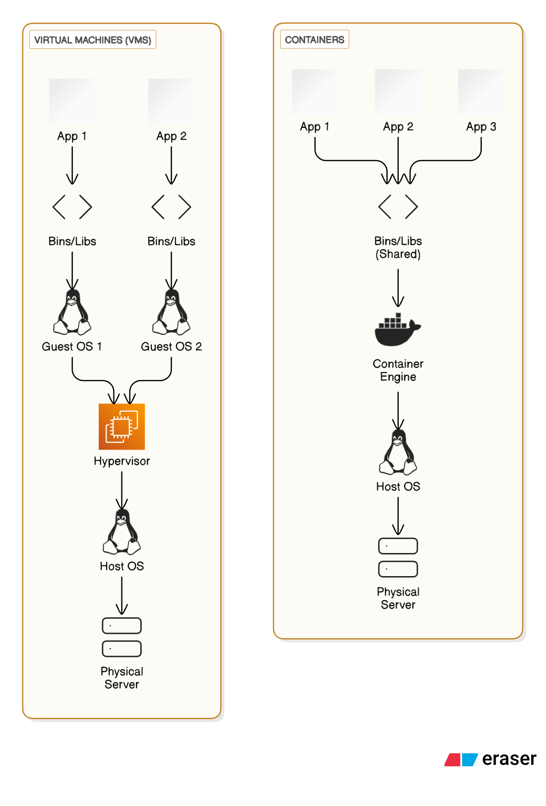
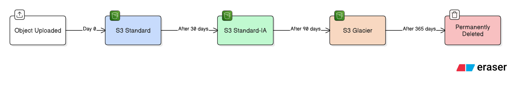
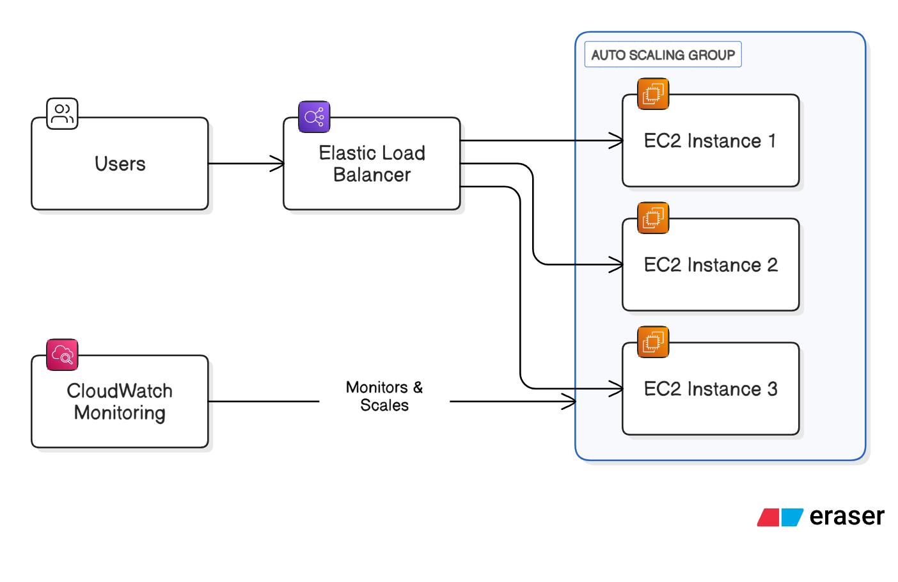
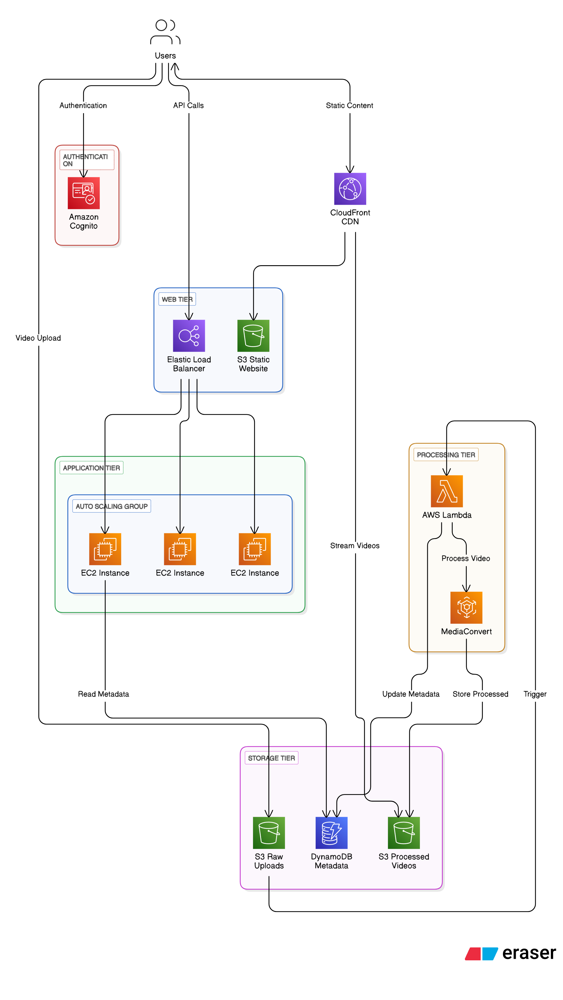

# FINAL EXAMINATION SEPTEMBER 2023 SEMESTER

**COURSE:** TEB3033 - DISTRIBUTED AND PARALLEL COMPUTING
**DATE:** 5 DECEMBER 2023 (TUESDAY)
**TIME:** 2:30 PM - 5:30 PM (3 HOURS)

## INSTRUCTIONS TO CANDIDATES

1.  Answer ALL questions in the Answer Booklet.
2.  Begin EACH answer on a new page in the Answer Booklet.
3.  Indicate clearly answers that are cancelled, if any.
4.  Where applicable, show clearly steps taken in arriving at the solutions and indicate ALL assumptions, if any.
5.  DO NOT open this Question Booklet until instructed.

**Note:**
i. There are SIX (6) pages in this Question Booklet including the cover page.
ii. DOUBLE-SIDED Question Booklet.

---

## Question 1

a. Discuss at least FOUR (4) the advantages of cloud computing over traditional IT infrastructure. [8 marks]

**Answer:**

Cloud computing offers several significant advantages over traditional on-premises IT infrastructure. Based on the AWS Cloud Foundations materials, here are four key advantages:

1.  **Trade Capital Expense for Variable Expense:**

    - Traditional IT requires significant upfront capital investment (CapEx) in hardware, data centers, and infrastructure before knowing how it will be used.
    - Cloud computing allows organizations to pay only for the compute power, storage, and other resources they actually consume on a variable, pay-as-you-go basis (OpEx). This eliminates the need for large initial investments and long procurement cycles.

2.  **Benefit from Massive Economies of Scale:**

    - Cloud providers like AWS operate at a massive scale, purchasing computing hardware in large volumes. This results in lower costs per unit than any individual company could achieve.
    - These savings are passed on to customers in the form of lower prices, allowing even small companies to access enterprise-grade infrastructure at a low cost.

3.  **Stop Guessing Capacity:**

    - In traditional IT, organizations must forecast their peak capacity needs and purchase hardware to meet that demand, which often leads to either expensive idle resources (over-provisioning) or poor performance during peak times (under-provisioning).
    - Cloud computing provides elasticity, allowing organizations to scale resources up or down automatically in response to actual demand. This ensures optimal performance without paying for unnecessary capacity.

4.  **Increase Speed and Agility:**
    - Traditional IT involves long procurement and setup times for new hardware, often taking weeks or months.
    - In the cloud, new IT resources are available in minutes with just a few clicks. This dramatically increases agility, allowing development teams to experiment, innovate, and deploy new applications much faster, reducing the time to market.

---

b. Explain the reasons behind low-cost services of cloud computing. [6 marks]

**Answer:**

Cloud computing services, such as those from AWS, are often lower in cost than traditional IT solutions for several key reasons:

1.  **Economies of Scale:** Because AWS serves hundreds of thousands of customers, it can achieve massive economies of scale. It purchases hardware and resources in bulk at a significantly lower cost and passes these savings on to customers.
2.  **Pay-as-you-go Model:** Customers only pay for the services they consume, for the duration they consume them. This eliminates the cost of idle, over-provisioned hardware that is common in on-premises data centers.
3.  **Volume-Based Discounts:** Many services, like Amazon S3 storage, have a tiered pricing model. The more you use, the less you pay per gigabyte. This rewards customers for scaling their usage on the platform.
4.  **Reserved Instances (RIs):** For predictable workloads, customers can reserve capacity for a 1- or 3-year term. This commitment allows AWS to better manage its capacity and in return, it offers customers a significant discount (up to 75%) compared to on-demand pricing.
5.  **Continuous Cost Reduction:** As AWS grows, its operational efficiency improves. It has a history of passing these savings on to customers by regularly lowering its prices.
6.  **Reduced Operational Costs:** By using the cloud, customers offload the costs associated with running a physical data center, including real estate, power, cooling, and the staff required for hardware maintenance.

---

c. Distinguish between cloud service models and cloud deployment models. [6 marks]

**Answer:**

Cloud service models and cloud deployment models are two fundamental ways to categorize cloud computing, but they describe different aspects of the cloud.

| Feature             | Cloud Service Models (IaaS, PaaS, SaaS)                                                                                                                                                                                                                                                                                                                                                                                                                 | Cloud Deployment Models (Cloud, Hybrid, On-premises)                                                                                                                                                                                                                                                                       |
| ------------------- | ------------------------------------------------------------------------------------------------------------------------------------------------------------------------------------------------------------------------------------------------------------------------------------------------------------------------------------------------------------------------------------------------------------------------------------------------------- | -------------------------------------------------------------------------------------------------------------------------------------------------------------------------------------------------------------------------------------------------------------------------------------------------------------------------- |
| **What it Defines** | **What is being offered.** It defines the level of management and control a customer has over their IT resources. It's about the _type_ of service.                                                                                                                                                                                                                                                                                                     | **Where the infrastructure is located.** It defines the physical location and ownership of the infrastructure. It's about the _location_ of the service.                                                                                                                                                                   |
| **Primary Focus**   | The division of responsibility between the cloud provider and the customer.                                                                                                                                                                                                                                                                                                                                                                             | The location and management of the underlying hardware and infrastructure.                                                                                                                                                                                                                                                 |
| **Examples**        | • **IaaS (Infrastructure as a Service):** Provides basic building blocks like virtual servers and storage. The customer has more control.   • **PaaS (Platform as a Service):** The provider manages the underlying infrastructure, allowing customers to focus on deploying applications.   • **SaaS (Software as a Service):** A complete application managed by the provider, delivered over the internet. The customer has the least control. | • **Cloud:** All applications and infrastructure run on a public cloud provider like AWS.   • **Hybrid:** A mix of on-premises infrastructure (private cloud) and public cloud services.   • **On-premises (Private Cloud):** Resources are deployed on-premises using virtualization and resource management tools. |
| **Analogy**         | How you consume a service (e.g., leasing a car, taking a taxi, or using a ride-sharing app).                                                                                                                                                                                                                                                                                                                                                            | Where the service operates from (e.g., a global network, a local office, or a combination).                                                                                                                                                                                                                                |

---

## Question 2

a. Explain the Amazon Web Services (AWS) shared responsibility model to define the responsibilities of customer and AWS. [6 marks]

**Answer:**

The AWS Shared Responsibility Model defines the division of security responsibilities between AWS and the customer. It clarifies which security controls AWS operates and which ones the customer implements and manages. The model is often summarized as: **AWS is responsible for security _OF_ the cloud, while the customer is responsible for security _IN_ the cloud.**

**AWS Responsibilities (Security OF the Cloud):**
AWS is responsible for protecting the global infrastructure that runs all of the services offered in the AWS Cloud. This includes:

- **Hardware:** The physical servers, storage devices, and networking equipment.
- **Software:** The foundational compute, storage, database, and networking services.
- **Global Infrastructure:** The physical security of data centers, including controlled access, as well as the management of AWS Regions, Availability Zones, and Edge Locations.
- **Virtualization Infrastructure:** The hypervisor and the isolation between instances running on the same physical hardware.

**Customer Responsibilities (Security IN the Cloud):**
The customer's responsibility depends on the AWS services they use. For IaaS services like Amazon EC2, the customer is responsible for:

- **Customer Data:** Securing their own data, including its classification and management.
- **Platform, Applications, Identity & Access Management:** Managing users, groups, roles, and permissions using services like AWS IAM.
- **Operating System, Network & Firewall Configuration:** Patching the guest OS, configuring security groups, and network ACLs.
- **Data Encryption:** Implementing both client-side encryption (before sending data to AWS) and server-side encryption (for data at rest in AWS).
- **Network Traffic Protection:** Encrypting data in transit between the client and AWS services.

For more managed services (PaaS, SaaS), AWS takes on more responsibility, but the customer is always responsible for their data and user access.

---

b. List the differences among Identity and Access Management (IAM) users, roles, and groups. [6 marks]

**Answer:**

IAM users, groups, and roles are fundamental components for managing access in AWS, but they serve distinct purposes.

| Feature              | **IAM User**                                                              | **IAM Group**                                                                      | **IAM Role**                                                                                                |
| -------------------- | ------------------------------------------------------------------------- | ---------------------------------------------------------------------------------- | ----------------------------------------------------------------------------------------------------------- |
| **What it is**       | An entity (a person or an application) that interacts with AWS.           | A collection of IAM users.                                                         | An identity with permissions that can be _assumed_ by a trusted entity (user, application, or AWS service). |
| **Credentials**      | Has permanent, long-term credentials, such as a password and access keys. | Does not have its own credentials; it is just a container for users.               | Provides temporary security credentials that are valid for a short, pre-defined duration.                   |
| **Primary Purpose**  | To provide a unique identity for authentication.                          | To simplify permissions management by applying policies to multiple users at once. | To delegate access securely without sharing long-term credentials.                                          |
| **Association**      | Uniquely associated with one person or application.                       | Can contain many users, and a user can belong to multiple groups.                  | Not associated with a specific person. Any trusted entity can assume a role when needed.                    |
| **Example Use Case** | A developer who needs programmatic access to AWS resources.               | A "Developers" group with read-only access to production S3 buckets.               | An EC2 instance needing to write logs to an S3 bucket; it assumes a role with the necessary permissions.    |

---

c. Compare the characteristics of security group and network access control lists to secure the networks in the cloud. [8 marks]

**Answer:**

Security Groups and Network Access Control Lists (NACLs) are both virtual firewalls used to control traffic in an Amazon VPC, but they operate at different levels and have distinct characteristics.

| Characteristic      | **Security Group**                                                                                                                           | **Network Access Control List (NACL)**                                                                                                                                   |
| ------------------- | -------------------------------------------------------------------------------------------------------------------------------------------- | ------------------------------------------------------------------------------------------------------------------------------------------------------------------------ |
| **Scope**           | Acts as a firewall at the **instance level**. It controls traffic to and from an EC2 instance.                                               | Acts as a firewall at the **subnet level**. It controls traffic in and out of one or more subnets.                                                                       |
| **Supported Rules** | Supports **allow rules only**. By default, all inbound traffic is denied, and all outbound traffic is allowed. You cannot create deny rules. | Supports both **allow and deny rules**. You can explicitly block specific IP addresses or ports.                                                                         |
| **Statefulness**    | **Stateful**. If you allow an inbound request, the outbound response traffic is automatically allowed, regardless of any outbound rules.     | **Stateless**. Return traffic must be explicitly allowed by a corresponding outbound (for inbound traffic) or inbound (for outbound traffic) rule.                       |
| **Rule Evaluation** | **All rules are evaluated** before a decision is made to allow traffic.                                                                      | **Rules are evaluated in number order**, starting with the lowest numbered rule. The first rule that matches the traffic is applied, regardless of any subsequent rules. |
| **Default State**   | The default security group denies all inbound traffic and allows all outbound traffic.                                                       | The default NACL allows all inbound and outbound traffic. A custom NACL denies all traffic until rules are added.                                                        |
| **Association**     | An instance can be associated with multiple security groups.                                                                                 | A subnet can only be associated with one NACL at a time.                                                                                                                 |

---

## Question 3

a. Differentiate between the SEVEN (7) types of Amazon Route 53 supported routing techniques. [7 marks]

**Answer:**

Amazon Route 53 is a DNS web service that provides various routing policies to direct end-user traffic to application endpoints. The seven main types are:

1.  **Simple Routing:** The standard DNS functionality. Used for a single resource that performs a given function (e.g., one web server). It doesn't support health checks.
2.  **Weighted Round Robin Routing:** Distributes traffic across multiple resources based on an assigned weight. For example, you can send 80% of traffic to one server and 20% to another, which is useful for A/B testing or blue-green deployments.
3.  **Latency Routing:** Routes users to the AWS Region that provides the lowest network latency for them. This helps improve the performance of global applications.
4.  **Geolocation Routing:** Routes users based on their geographic location (e.g., continent, country, or state). This is used for localizing content or enforcing geographic restrictions.
5.  **Geoproximity Routing:** Routes traffic based on the geographic location of both users and resources. It can optionally bias traffic towards or away from resources in certain locations.
6.  **Failover Routing:** An active-passive failover configuration. It routes traffic to a primary resource, and if that resource becomes unhealthy (as determined by a health check), it automatically routes traffic to a secondary (backup) resource.
7.  **Multivalue Answer Routing:** Similar to simple routing but allows you to return up to eight healthy records in response to a DNS query. Route 53 randomly selects one of the healthy records for the client, which helps with load balancing and fault tolerance on the client side.

---

b. Categorize the AWS compute services into FOUR (4) classes while describing their use case and characteristics. [8 marks]

**Answer:**

AWS compute services can be categorized into four main classes, each serving different needs and offering different levels of abstraction and control.

1.  **Virtual Machines (IaaS - Infrastructure as a Service)**

    - **Service:** Amazon EC2 (Elastic Compute Cloud)
    - **Characteristics:** Provides resizable virtual servers (instances) in the cloud. It offers full control over the guest operating system, software stack, and virtual networking. It is instance-based.
    - **Use Case:** Ideal for traditional applications, migrating existing on-premises workloads, and situations requiring complete control over the environment. It is a familiar concept for most IT professionals.

2.  **Serverless Compute (Function as a Service)**

    - **Service:** AWS Lambda
    - **Characteristics:** Allows you to run code without provisioning or managing servers. It is function-based and event-driven, meaning code runs in response to triggers (e.g., an S3 upload or an API call). It is low-cost as you only pay for the compute time you consume.
    - **Use Case:** Perfect for event-driven architectures, microservices backends, data processing, and scheduled tasks. It's a newer concept that requires an architectural shift but offers high efficiency.

3.  **Container-Based Compute**

    - **Services:** Amazon ECS (Elastic Container Service), Amazon EKS (Elastic Kubernetes Service), AWS Fargate
    - **Characteristics:** These services manage and orchestrate software containers (like Docker). ECS and EKS allow you to run containers on a cluster of EC2 instances that you manage, while Fargate is a serverless compute engine for containers, removing the need to manage the underlying servers.
    - **Use Case:** Best for microservices architectures, batch processing, and deploying portable and scalable applications. Fargate reduces administrative overhead, while EC2-backed clusters provide more control.

4.  **Platform as a Service (PaaS)**
    - **Service:** AWS Elastic Beanstalk
    - **Characteristics:** A fully managed service that simplifies the deployment and scaling of web applications. You simply upload your code, and Elastic Beanstalk automatically handles capacity provisioning, load balancing, auto-scaling, and application health monitoring.
    - **Use Case:** Ideal for developers who want to quickly deploy web applications without worrying about the underlying infrastructure. It is fast and easy to get started.

---

c. List the differences between virtual machines and containers with the help of suitable diagrams. [5 marks]

**Answer:**

Virtual machines (VMs) and containers are both virtualization technologies, but they differ fundamentally in their architecture and efficiency.

**Differences:**

1.  **Operating System (OS) Level:**

    - **VMs:** Each VM runs a complete guest operating system on top of a hypervisor. This includes its own kernel, libraries, and binaries.
    - **Containers:** Containers share the host operating system's kernel. They only package the application's code, libraries, and dependencies.

2.  **Size and Portability:**

    - **VMs:** Are much larger (measured in gigabytes) because they include a full OS. They are less portable.
    - **Containers:** Are lightweight (measured in megabytes) because they don't bundle an OS. This makes them highly portable and faster to start.

3.  **Resource Overhead:**
    - **VMs:** Have higher resource overhead due to running a full OS for each VM.
    - **Containers:** Have lower overhead, allowing more containers to run on a single host compared to VMs, leading to better resource utilization.

**Diagrammatic Representation:**

- **On the left (VMs):** Each application is isolated within its own complete virtual machine, including a separate Guest OS.
- **On the right (Containers):** Multiple applications run as isolated containers, but they all share the same Host OS and its kernel through the Container Engine (e.g., Docker).

---

## Question 4

a. Define the AWS Simple Storage Service (S3) classes while illustrating their lifecycle transitions. [6 marks]

**Answer:**

Amazon S3 (Simple Storage Service) is an object storage service that offers a range of storage classes designed for different use cases. These classes vary by durability, availability, performance, and cost.

**S3 Storage Classes:**

1.  **S3 Standard:** Designed for frequently accessed data that requires low latency and high throughput. It offers high durability and availability. It is the most expensive class.
2.  **S3 Intelligent-Tiering:** Automatically moves data between a frequent access tier and an infrequent access tier to optimize costs for data with unknown or changing access patterns.
3.  **S3 Standard-Infrequent Access (S3 Standard-IA):** For data that is accessed less frequently but requires rapid access when needed. It has a lower storage price than S3 Standard but charges a per-GB retrieval fee.
4.  **S3 One Zone-Infrequent Access (S3 One Zone-IA):** Similar to S3 Standard-IA but stores data in a single Availability Zone. This makes it less expensive but also less resilient. Good for easily reproducible, infrequently accessed data.
5.  **S3 Glacier:** Designed for long-term data archival. It is extremely low-cost storage, but retrieval times can range from minutes to hours.
6.  **S3 Glacier Deep Archive:** The lowest-cost storage class, designed for archiving data that is rarely accessed. Retrieval times are typically within 12 hours.

**Lifecycle Transitions Illustration:**
S3 Lifecycle policies automate the migration of objects between storage classes based on their age. This helps to reduce storage costs over time.

A typical lifecycle transition for an object could be:

This policy ensures that data is stored in the most cost-effective tier throughout its lifetime, moving from more expensive, high-performance tiers to cheaper, archival tiers as it becomes less frequently accessed.

---

b. Differentiate between a DBMS hosted on your Elastic Compute Cloud (EC2) machine and AWS RDS while debating AWS managed and un-managed services. [7 marks]

**Answer:**

The choice between running a Database Management System (DBMS) on an EC2 instance versus using Amazon RDS represents a classic trade-off between control (unmanaged) and convenience (managed).

**DBMS on EC2 (Unmanaged Service):**
This is an Infrastructure as a Service (IaaS) approach. You provision an EC2 virtual server and are responsible for installing, configuring, and managing the entire database stack yourself.

- **Your Responsibilities (Unmanaged):**
  - OS installation and patching.
  - Database software installation, patching, and configuration.
  - Implementing high availability and failover.
  - Configuring and managing database backups and disaster recovery.
  - Scaling the instance (compute and storage) manually.
- **Advantages:**
  - **Full Control:** You have root access to the OS and can fine-tune every aspect of the database and its environment.
  - **Flexibility:** You can use any DBMS version or type, including those not supported by RDS.
- **Disadvantages:**
  - **High Operational Overhead:** Requires significant time and expertise to manage and maintain.

**Amazon RDS (Managed Service):**
This is a Platform as a Service (PaaS) approach. AWS automates the time-consuming administrative tasks associated with managing a database.

- **AWS Responsibilities (Managed):**
  - Provisioning the infrastructure.
  - OS and database software patching.
  - Automated backups.
  - Built-in high availability with Multi-AZ deployments.
  - Simplified scaling of compute and storage.
- **Advantages:**
  - **Reduced Administrative Burden:** Allows you to focus on application development and schema optimization rather than database administration.
  - **Ease of Use:** Features like automated backups, failover, and scaling are easy to configure.
- **Disadvantages:**
  - **Less Control:** You do not have root access to the underlying server and cannot install custom software or certain plugins. You are limited to the database engines and versions that AWS supports.

**Debate Summary:**

- Choose **DBMS on EC2** when you need maximum control, require a specific database version or feature not available on RDS, or have existing database licenses you want to use. This is the **unmanaged** path, trading convenience for control.
- Choose **Amazon RDS** for most standard use cases where you want to minimize operational overhead and benefit from automated management features. This is the **managed** path, trading some control for significant convenience and operational efficiency.

---

c. Explain the relationship between load balancing and auto-scaling in cloud services with illustrated diagram. [7 marks]

**Answer:**

Elastic Load Balancing (ELB) and Auto Scaling are two distinct AWS services that work together to create a scalable, highly available, and fault-tolerant application architecture.

**Relationship:**

- **Elastic Load Balancing (ELB):** Acts as a single point of contact for clients and distributes incoming application traffic across multiple targets, such as EC2 instances. By spreading the load, it improves responsiveness and increases the availability of your application. If one instance fails, the load balancer redirects traffic to the remaining healthy instances.
- **Auto Scaling:** Automatically adjusts the number of compute resources (e.g., EC2 instances) in a group based on traffic demand or a defined schedule. It scales _out_ (adds instances) during traffic spikes to maintain performance and scales _in_ (removes instances) during lulls to reduce costs.

**How They Work Together:**
An Auto Scaling group is typically placed behind an Elastic Load Balancer.

1.  The ELB receives all incoming user traffic.
2.  It distributes this traffic evenly across the healthy EC2 instances currently in the Auto Scaling group.
3.  Auto Scaling monitors the instances (e.g., using CloudWatch metrics like CPU utilization).
4.  If the load increases, Auto Scaling automatically launches new EC2 instances. These new instances are automatically registered with the ELB, which begins sending traffic to them.
5.  If the load decreases, Auto Scaling terminates unneeded instances. These instances are automatically de-registered from the ELB, which stops sending them traffic.

This combination ensures that the application has both the capacity to handle the current load and the fault tolerance to survive an individual instance failure.

**Illustrated Diagram:**

In this diagram, the Load Balancer distributes traffic, while the Auto Scaling Group manages the number of EC2 instances behind it to match demand.

---

## Question 5

a. Suppose you are a cloud solution developer. You are given a task to design and deploy a YouTube-like video-sharing platform. Users upload videos to the platform after sign in to their account. Other users can watch the uploaded videos. Propose your cloud-based solution with the help of a diagram depicting web frontend, servers, databases, load balancers and other entities with their relationships. [10 marks]

**Answer:**

**Proposed Solution for a Video-Sharing Platform on AWS:**

This solution is designed for scalability, durability, and global performance, leveraging managed services to reduce operational overhead.

**Architecture Diagram and Workflow:**

**Workflow Description:**

1.  **User Authentication:** Users sign up and sign in using **Amazon Cognito**, which manages user identities and provides secure authentication.
2.  **Frontend Delivery:** The platform's web interface (HTML, CSS, JavaScript) is hosted as a static website in an **Amazon S3 bucket**. This content is delivered to users globally with low latency via **Amazon CloudFront**, a Content Delivery Network (CDN).
3.  **Video Upload:** An authenticated user uploads a raw video file directly to a dedicated **S3 bucket for uploads**.
4.  **Video Processing (Transcoding):** The upload to the S3 bucket triggers an **AWS Lambda function**. This function initiates a video processing job (using a service like AWS Elemental MediaConvert) to transcode the raw video into multiple formats and resolutions (e.g., 1080p, 720p, 480p) suitable for different devices and bandwidths.
5.  **Metadata Storage:** After processing, the Lambda function writes metadata about the video (e.g., title, description, user ID, URLs to the processed video files) into an **Amazon DynamoDB** table. DynamoDB is chosen for its scalability and low-latency performance, which is ideal for a large catalog of videos.
6.  **Processed Video Storage:** The transcoded video files are stored in a separate **S3 bucket for processed content**.
7.  **Application Logic:** The core backend logic (handling comments, user profiles, video searches, recommendations) runs on a fleet of **Amazon EC2 instances** managed by an **Auto Scaling Group**.
8.  **Traffic Management:** An **Elastic Load Balancer (ELB)** sits in front of the EC2 instances, distributing incoming API requests from the frontend across the fleet. The Auto Scaling Group automatically adds or removes instances based on traffic load to ensure performance and cost-efficiency.
9.  **Video Playback:** When a user wants to watch a video, the application fetches the video URLs from DynamoDB and serves the video content from the processed S3 bucket via **Amazon CloudFront**. Using CloudFront for video delivery ensures fast, low-latency streaming for viewers anywhere in the world.

---

b. Identify the AWS services that your proposed solution will utilize. Provide a summary of each of the proposed AWS service. [10 marks]

**Answer:**

The proposed solution utilizes the following key AWS services:

1.  **Amazon S3 (Simple Storage Service):** An object storage service used for storing raw video uploads, transcoded video files, and the static assets for the web frontend. It is highly durable and scalable.
2.  **Amazon EC2 (Elastic Compute Cloud):** A service that provides secure, resizable virtual servers (instances) in the cloud. It is used to run the application backend servers that handle business logic like user interactions and API requests.
3.  **Elastic Load Balancing (ELB):** Automatically distributes incoming application traffic across multiple EC2 instances. This ensures high availability and fault tolerance for the application backend.
4.  **Auto Scaling:** Monitors the application and automatically adjusts the number of EC2 instances to maintain steady, predictable performance at the lowest possible cost.
5.  **AWS Lambda:** A serverless compute service that lets you run code without managing servers. In this solution, it is triggered by video uploads to S3 to orchestrate the video transcoding process.
6.  **Amazon DynamoDB:** A fast, flexible NoSQL database service for applications that need consistent, single-digit millisecond latency at any scale. It is used to store video metadata, user information, and comments.
7.  **Amazon CloudFront:** A fast content delivery network (CDN) service that securely delivers data, videos, applications, and APIs to customers globally with low latency and high transfer speeds. It is used to serve both the static web frontend and the video content.
8.  **Amazon Cognito:** Provides user identity and access management, making it easy to add user sign-up, sign-in, and access control to web and mobile apps.
9.  **AWS Identity and Access Management (IAM):** A web service that helps you securely control access to AWS resources. It is used to define roles and policies to ensure that each component of the architecture (e.g., Lambda, EC2 instances) has only the permissions it needs (principle of least privilege).

---

**- END OF PAPER -**

---
