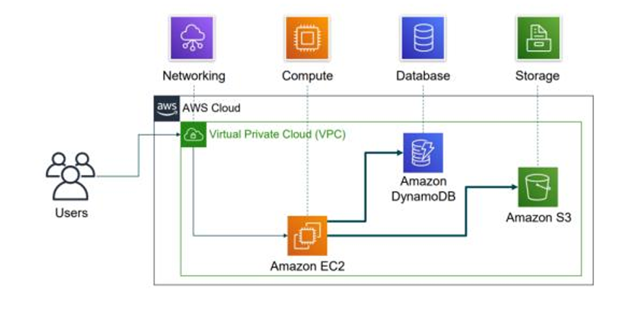

# Test 1

### 1. Compare the key advantages of cloud computing and traditional IT infrastructure. [4 marks]

Cloud computing offers several key advantages over traditional IT infrastructure by shifting from a capital expense (CapEx) model to a variable, operational expense (OpEx) model.

| Feature             | Traditional IT Infrastructure                                                                                                           | Cloud Computing (AWS)                                                                                                                                                        |
| :------------------ | :-------------------------------------------------------------------------------------------------------------------------------------- | :--------------------------------------------------------------------------------------------------------------------------------------------------------------------------- |
| **Cost Model**      | Requires large upfront capital investment in hardware and infrastructure (CapEx).                                                       | Pay-as-you-go model; pay only for the resources you consume (OpEx).                                                                                                          |
| **Capacity**        | Capacity is fixed and must be provisioned in advance based on peak forecasts, often leading to over-provisioning or under-provisioning. | Elastic and scalable; easily scale resources up or down to match demand, eliminating the need to guess capacity.                                                             |
| **Speed & Agility** | Long procurement cycles for hardware can take weeks or months to get new resources.                                                     | New resources can be provisioned in minutes, significantly increasing the speed and agility of development and deployment.                                                   |
| **Global Reach**    | Expanding globally is expensive and time-consuming, requiring the setup of new data centers.                                            | Easily deploy applications in multiple AWS Regions around the world in just a few clicks, providing lower latency for a global user base.                                    |
| **Maintenance**     | The organization is responsible for all maintenance, including running data centers, managing servers, power, cooling, and security.    | AWS manages the underlying infrastructure, allowing organizations to stop spending money on "undifferentiated heavy lifting" and focus on their core business and customers. |

### 2. Differentiate between the AWS Region and the Availability Zone. [4 marks]

An **AWS Region** and an **Availability Zone (AZ)** are fundamental components of the AWS Global Infrastructure, but they serve different purposes related to geography and fault isolation.

- **AWS Region:**

  - A Region is a **physical, geographic area** in the world (e.g., US East (N. Virginia), EU (Ireland)).
  - Each Region is completely isolated from other AWS Regions.
  - It provides full redundancy and connectivity to the network.
  - Data replication and service deployment across Regions are controlled by the user for disaster recovery and latency reduction.
  - A Region consists of two or more Availability Zones.

- **Availability Zone (AZ):**
  - An AZ is a **fully isolated partition within an AWS Region**. It consists of one or more discrete data centers.
  - Each AZ has independent power, cooling, and physical security and is connected via redundant, ultra-low-latency networks.
  - AZs are physically separated from each other within a region, making them resilient to failures in other AZs (e.g., fires, floods, power outages).
  - AWS recommends deploying applications across multiple AZs for high availability and fault tolerance.

**In summary:** A Region is a large, geographically distinct area, while an Availability Zone is an isolated, fault-tolerant location _within_ that Region.

### 3. Given the AWS architecture in the diagram that uses Amazon EC2, DynamoDB, and S3 within a Virtual Private Cloud (VPC), Discuss how would you design the system to ensure: [8 marks]

#### a) High availability during a regional outage?

To ensure high availability during a regional outage, a multi-region architecture is required. The entire stack (compute, database, storage) must be replicated in a secondary, geographically separate AWS Region.

1.  **EC2 (Compute):** Deploy EC2 instances within an Auto Scaling group behind an Elastic Load Balancer in the secondary region. Use Amazon Machine Images (AMIs) to ensure consistent instance configurations across regions.
2.  **DynamoDB (Database):** Use **DynamoDB Global Tables**. This service provides a fully managed, multi-region, multi-active database by automatically replicating table data between your chosen AWS Regions with low latency.
3.  **S3 (Storage):** Configure **S3 Cross-Region Replication (CRR)** for the S3 bucket. This will automatically and asynchronously copy objects from the primary region's bucket to a bucket in the secondary region.
4.  **Traffic Routing:** Use **Amazon Route 53** with a **Failover routing policy**. Route 53 can monitor the health of the primary region's endpoint and automatically redirect user traffic to the resources in the secondary region if the primary region becomes unavailable.

#### b) Cost optimization by minimizing storage and compute costs?

Cost optimization can be achieved by using the right pricing models and storage management features.

1.  **EC2 (Compute):** For workloads that are fault-tolerant and can be interrupted, use **EC2 Spot Instances**, which offer up to a 90% discount compared to On-Demand prices. For predictable workloads, **Reserved Instances** or **Savings Plans** can provide significant discounts over On-Demand pricing. Implement **Auto Scaling** to scale the number of instances down during periods of low demand, ensuring you only pay for the compute capacity you need.
2.  **S3 (Storage):** Implement **S3 Lifecycle Policies** to automatically transition data to more cost-effective storage classes as it ages. For example, data that is no longer frequently accessed can be moved from S3 Standard to S3 Standard-Infrequent Access (S3 Standard-IA) or archived in **S3 Glacier** for long-term storage at a very low cost.

#### c) Security by controlling access to the data in S3 and DynamoDB?

Security is achieved through a defense-in-depth approach using IAM and networking controls.

1.  **IAM Roles for EC2:** Instead of storing credentials on the EC2 instance, assign an **IAM Role** to the instance. This role should have an attached IAM policy that grants the principle of least privilege—only the specific permissions needed to access the required DynamoDB table and S3 bucket (e.g., `s3:GetObject`, `dynamodb:PutItem`).
2.  **Security Groups:** Use Security Groups as a stateful firewall for the EC2 instances. Configure rules to allow only necessary inbound traffic (e.g., HTTPS from users) and restrict outbound traffic to only what is required for the application to function.
3.  **S3 Bucket Policies:** Attach a **Bucket Policy** directly to the S3 bucket. This resource-based policy can explicitly allow or deny access to objects based on the requester, IP address, or other conditions, providing granular control over the data. Also, enable **S3 Block Public Access** to prevent accidental public exposure.
4.  **VPC Endpoints:** To ensure traffic between the EC2 instance and S3/DynamoDB does not traverse the public internet, use **VPC Endpoints**. A Gateway Endpoint can be used for S3 and DynamoDB, keeping all traffic within the secure AWS network.

### 4. Discuss the Similarities between AWS and traditional IT. [6 marks]

While AWS operates on a different model, the core components and concepts have direct parallels to a traditional, on-premises IT environment. Almost anything that can be implemented with traditional IT can also be implemented using AWS services.

- **Networking:** In traditional IT, physical routers, switches, and network pipelines manage traffic flow. In AWS, **Amazon VPC**, **Elastic Load Balancing**, and subnets provide the same logical networking structure to isolate and direct traffic.
- **Compute:** On-premises environments rely on physical servers. AWS provides virtual servers known as **Amazon EC2 instances**, which are provisioned from Amazon Machine Images (AMIs), analogous to imaging a physical server.
- **Storage & Databases:** Traditional IT uses Direct Attached Storage (DAS), Storage Area Networks (SANs), and Network Attached Storage (NAS). AWS offers equivalent services like **Amazon EBS** (block storage, like a SAN), **Amazon EFS** (file storage, like a NAS), and **Amazon S3** (object storage). For databases, a traditional Relational Database Management System (RDBMS) is mirrored by managed services like **Amazon RDS**.
- **Security:** Traditional data centers use physical firewalls and Access Control Lists (ACLs) to secure the network. AWS uses **Security Groups** (acting as instance-level firewalls) and **Network ACLs** (acting as subnet-level firewalls) to achieve the same goal. User and permission management, handled by administrators in traditional IT, is managed in AWS through **AWS Identity and Access Management (IAM)**.

### 5. Describe how fault tolerance is achieved within AWS Availability Zones. [5 marks]

Fault tolerance is a core principle in the design of the AWS Global Infrastructure, specifically through the architecture of Availability Zones (AZs).

1.  **Isolation and Redundancy:** Each AZ is a fully isolated partition within an AWS Region. It consists of one or more discrete data centers with redundant power, networking, and connectivity. These are housed in separate facilities.
2.  **Physical Separation:** AZs within a single Region are physically separated by a meaningful distance to protect against localized disasters like fires, floods, or power failures affecting a single data center.
3.  **High-Speed Interconnection:** Despite being physically separate, all AZs in a Region are interconnected with high-bandwidth, low-latency networking. This allows for fast, synchronous replication of data between AZs.
4.  **Service Architecture:** AWS services are designed to leverage this infrastructure. By architecting an application to run across **multiple Availability Zones**, it can remain operational even if one entire AZ fails. For example, an Auto Scaling group can be configured to span multiple AZs, or a database can be deployed in a Multi-AZ configuration (like Amazon RDS) where a standby replica is maintained in a different AZ for automatic failover.

### 6. Assume you are a developer writing a new application in Python that needs to store files in Amazon S3. You want your application code to directly upload these files. Which method would you use? [5 marks]

The most direct and standard method for an application to programmatically interact with AWS services is by using the **AWS Software Development Kit (SDK)**.

For a Python application, I would use the **AWS SDK for Python**, which is named **Boto3**.

This method is ideal because:

- It provides a high-level, object-oriented API to interact with S3 and other AWS services.
- It handles the complexities of authentication, request signing, connection management, and error handling.
- It allows the application code to perform S3 operations like creating buckets, listing objects, and uploading/downloading files directly, without needing to manually construct API requests.
- It integrates seamlessly with IAM roles when running on an EC2 instance, which is the most secure way to grant permissions to an application.

### 7. UTP wants to launch an online platform for students needing computing resources for projects and simulations. Student usage is highly unpredictable, with big spikes during exams and low use during breaks. Why is AWS a better budget and efficiency choice than building their own server room, given these changing demands? [8 marks]

AWS is a significantly better budget and efficiency choice for UTP's platform compared to building a traditional server room, primarily due to its ability to handle unpredictable and variable demand cost-effectively.

1.  **Trade Capital Expense for Variable Expense:** Building a server room requires a massive upfront capital investment (CapEx) in hardware, networking, cooling, and physical space. With AWS, there is no upfront cost. UTP pays only for the compute and storage resources it consumes on a pay-as-you-go basis (OpEx).
2.  **Elasticity and Ability to Handle Spikes:** The platform's demand is highly variable.
    - **On-Premises:** UTP would have to provision enough servers to handle the _peak_ demand seen during exams. During breaks and off-peak times, this expensive hardware would sit idle, wasting money and electricity. If a spike exceeds their provisioned capacity, the platform would crash.
    - **AWS:** UTP can use **Amazon EC2 Auto Scaling**. This service automatically adds more EC2 instances to handle the spikes in demand during exams and then automatically removes those instances when demand is low during breaks. This ensures the platform is always available and that UTP only pays for the compute power it actually uses.
3.  **Eliminate Undifferentiated Heavy Lifting:** Managing a physical server room involves significant operational overhead: server maintenance, OS patching, managing power and cooling, and physical security. By using AWS, UTP offloads this responsibility to Amazon, allowing their IT staff to be more efficient and focus on developing and improving the online platform for students, rather than managing infrastructure.
4.  **Benefit from Massive Economies of Scale:** AWS operates at a massive scale, which allows them to offer lower prices than a single university could achieve on its own. UTP benefits from these economies of scale, resulting in lower overall costs for the required computing resources.

---

# Test 2

### 1. Your company hosts a web application on an Amazon EC2 instance. Recently, the application was compromised due to an unpatched operating system vulnerability.

#### i. Identify who is responsible for this security lapse, and what could have been done to prevent it.

- **Who is responsible:** According to the **AWS Shared Responsibility Model**, the **customer** is responsible for this security lapse. AWS is responsible for the security _of_ the cloud (the physical hardware, networking, and facilities), but the customer is responsible for security _in_ the cloud. This includes managing and patching the guest operating system on their Amazon EC2 instances.

- **What could have been done to prevent it:**
  1.  **Regular Patching:** The company should have a process for regularly scanning for and applying security patches to the operating system of the EC2 instance.
  2.  **Use AWS Systems Manager Patch Manager:** This service can be used to automate the process of patching managed instances with both security-related and other types of updates.
  3.  **Use Amazon Inspector:** This service could have been used to automatically scan the EC2 instance for vulnerabilities, which would have identified the missing patch before it was exploited.

### 2. Compare between any TWO (2) types of Amazon Database services.

Here is a comparison between **Amazon RDS (Relational Database Service)** and **Amazon DynamoDB (NoSQL Database Service)**.

| Feature           | Amazon RDS                                                                                                                                                                               | Amazon DynamoDB                                                                                                                                                                        |
| :---------------- | :--------------------------------------------------------------------------------------------------------------------------------------------------------------------------------------- | :------------------------------------------------------------------------------------------------------------------------------------------------------------------------------------- |
| **Database Type** | **Relational (SQL)**. It supports engines like MySQL, PostgreSQL, MariaDB, Oracle, and SQL Server.                                                                                       | **Non-relational (NoSQL)**. It is a key-value and document database.                                                                                                                   |
| **Data Model**    | Data is stored in a structured format with predefined tables, rows, and columns. Enforces a rigid schema.                                                                                | Data is stored in tables made of items (like rows) with attributes (like columns). It supports a flexible, dynamic schema where items in the same table can have different attributes. |
| **Scaling**       | Primarily scales **vertically** (by increasing the compute power—CPU/RAM—of the DB instance). Horizontal scaling is possible via read replicas but is more complex for write operations. | Scales **horizontally** seamlessly and automatically by partitioning data across multiple servers. It is designed for massive scale with no practical limits on throughput or storage. |
| **Performance**   | Performance is excellent for complex queries and transactions (joins, etc.) but can become a bottleneck at very high request rates.                                                      | Delivers consistent, single-digit millisecond latency at any scale. It is optimized for simple GET/PUT operations on items identified by a primary key.                                |
| **Management**    | A managed service where AWS handles OS patching, database setup, and backups, but the user still manages schema, optimization, and database settings.                                    | A **fully managed (serverless)** service. AWS manages the underlying hardware, software, setup, configuration, replication, patching, and scaling.                                     |

### 3. Elaborate any THREE (3) advantages of using DynamoDB as a NoSQL database in a real-world application.

1.  **Seamless Scalability:** DynamoDB is built for scale. It scales horizontally by automatically partitioning data and traffic over a sufficient number of servers to meet performance requirements. There are no limits on table size or throughput, and scaling does not cause downtime. This makes it ideal for applications that start small and grow to a massive scale, such as gaming, mobile apps, or IoT applications.
2.  **High Performance and Low Latency:** DynamoDB provides consistent, single-digit millisecond read and write latency at any scale. It uses Solid State Drives (SSDs) and features like DynamoDB Accelerator (DAX), an in-memory cache, to further reduce latency to microseconds. This predictable performance is crucial for real-world applications requiring a responsive user experience, like e-commerce checkouts or real-time bidding.
3.  **Fully Managed (Serverless):** DynamoDB is a serverless database, which means developers don't have to worry about provisioning hardware, setting up and configuring software, patching, or operating database clusters. AWS handles all the underlying administration tasks, including backups, fault tolerance, and scaling. This significantly reduces operational overhead and allows developers to focus on building the application itself.

### 4. Describe the process of securing a new AWS account using IAM.

Securing a new AWS account involves a series of best practices focused on moving away from the all-powerful root user and implementing the principle of least privilege.

1.  **Stop Using the Root User:** The first and most critical step is to stop using the account root user for everyday tasks. The root user has unrestricted access and should only be used for specific tasks that require it (e.g., changing support plans, closing the account).
2.  **Create an Administrative IAM User:** While logged in as root, create your first IAM user. Add this user to a new IAM group (e.g., "Administrators") and attach the `AdministratorAccess` managed policy to the group. This user will be used for day-to-day administrative tasks instead of the root user.
3.  **Enable Multi-Factor Authentication (MFA):** Enable MFA for the root user immediately. Furthermore, require all IAM users to enable MFA. MFA adds a critical second layer of security on top of a password, protecting accounts from compromised credentials.
4.  **Use IAM Groups and Roles:** Instead of applying permissions directly to users, create IAM groups that represent job functions (e.g., "Developers", "DatabaseAdmins"). Attach permission policies to these groups, and then assign users to the appropriate groups. Use IAM roles to delegate permissions to applications running on EC2 or to grant temporary access to users.
5.  **Apply a Strong Password Policy:** Configure a strong password policy for IAM users in the account settings. This policy can enforce minimum password length, complexity requirements (uppercase, lowercase, numbers, symbols), and password rotation.

### 5. Define the Multi-Factor Authentication (MFA), and explain the benefits of using it for AWS accounts.

- **Definition:** Multi-Factor Authentication (MFA) is a security best practice that adds an extra layer of protection on top of a username and password. It requires a user to provide two or more verification factors to gain access to a resource. For AWS, this typically involves the user's password (something they know) and a unique, time-sensitive authentication code from a physical or virtual MFA device (something they have).

- **Benefits for AWS Accounts:**
  1.  **Enhanced Security:** The primary benefit is a significant increase in security. Even if a user's password is stolen, lost, or compromised, an attacker cannot access the AWS account without physical possession of the authenticated MFA device.
  2.  **Protection Against Credential Compromise:** It protects against common attacks like phishing, brute-force attacks, and credential stuffing.
  3.  **Reduced Risk:** By securing access to both the root user and individual IAM users, MFA reduces the risk of unauthorized access, data breaches, and malicious activity within the AWS environment. It is a foundational step in securing any AWS account.

### 6. Elaborate the importance of data security in Amazon Simple Storage Service (Amazon S3).

Data security in Amazon S3 is critically important because S3 is designed to store a virtually unlimited amount of data, which often includes sensitive, proprietary, or regulated information such as customer data, financial records, application backups, and intellectual property. A failure to secure this data can have severe consequences.

The importance can be broken down into three key areas:

1.  **Preventing Data Breaches and Unauthorized Access:** By default, S3 buckets and objects are private. However, misconfigurations can lead to public exposure. Strong security prevents unauthorized parties from accessing, stealing, or misusing sensitive data. This is crucial for maintaining customer trust, protecting intellectual property, and preventing financial loss.
2.  **Ensuring Regulatory Compliance:** Many industries are subject to compliance standards like GDPR, HIPAA, and PCI DSS, which mandate strict controls over data privacy and protection. S3 provides tools like encryption, access logging via CloudTrail, and IAM controls that help organizations meet these requirements and avoid significant legal and financial penalties.
3.  **Maintaining Data Integrity and Availability:** Security is not just about confidentiality; it's also about integrity (ensuring data isn't altered) and availability (ensuring it's accessible when needed). Features like S3 Versioning and MFA Delete protect against accidental or malicious deletion of data, ensuring that critical information remains intact and available for business operations.

AWS provides a rich set of tools to secure S3 data, including **encryption** (at rest and in transit), **access control** (IAM policies, bucket policies, and ACLs), and **S3 Block Public Access**, underscoring its shared responsibility in providing a secure platform.
