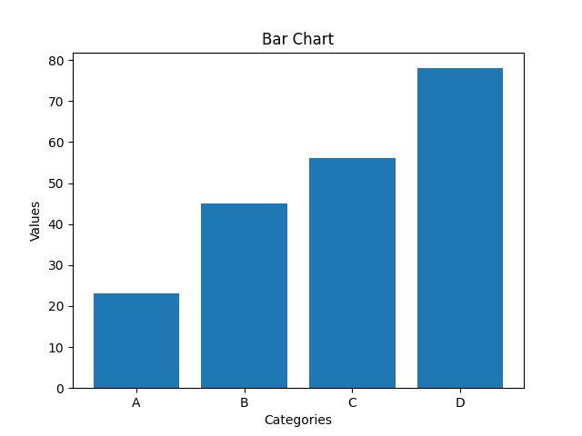
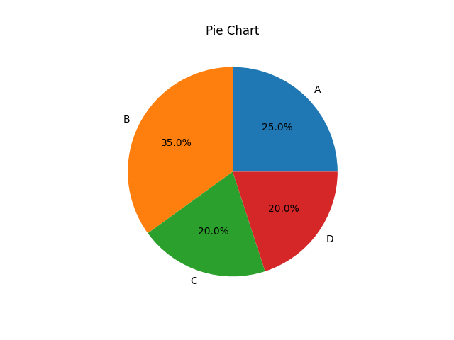
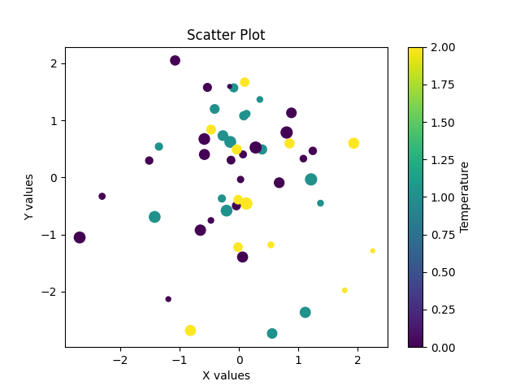
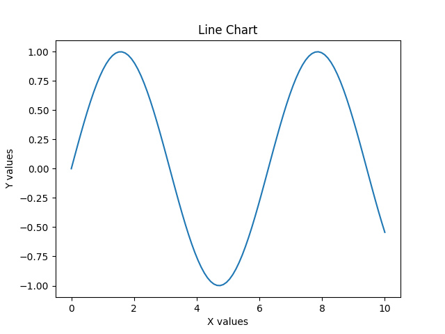
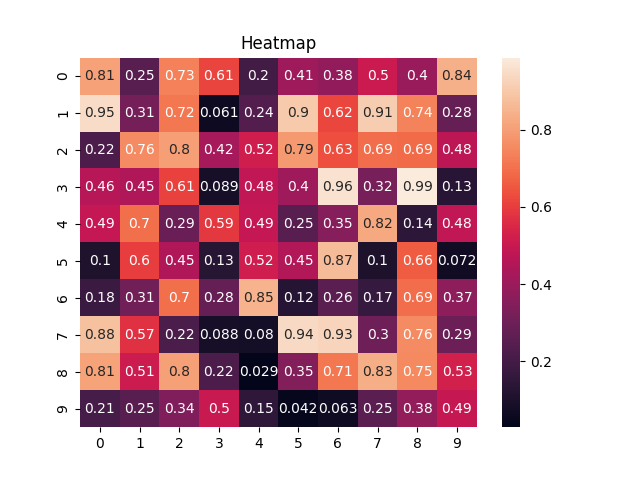
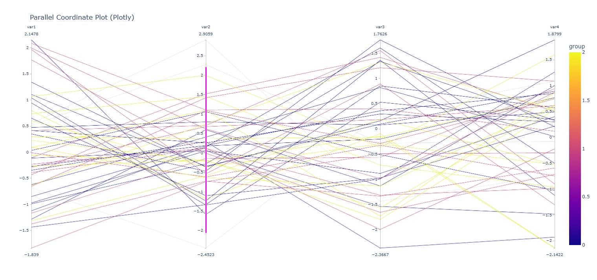
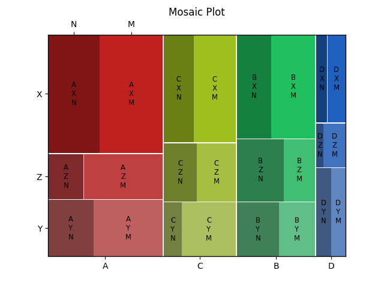
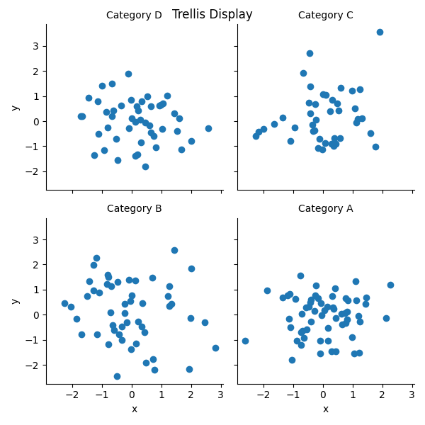
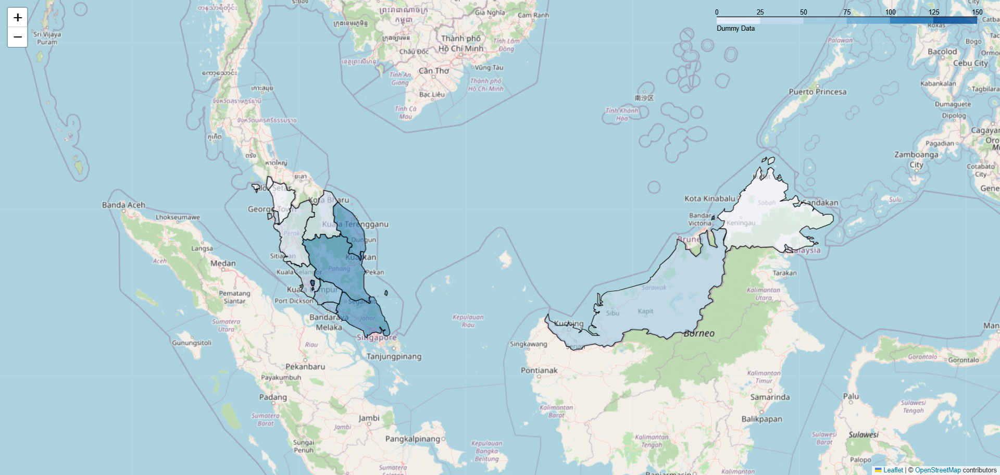

# Charts

## Bar Chart



```python
import matplotlib.pyplot as plt

# Dummy data
categories = ['A', 'B', 'C', 'D']
values = [23, 45, 56, 78]

# Create bar chart
plt.figure()
plt.bar(x=categories, height=values)
plt.title('Bar Chart')
plt.xlabel('Categories')
plt.ylabel('Values')
```

## Pie Chart



```python
import matplotlib.pyplot as plt

# Dummy data
labels = ['A', 'B', 'C', 'D']
sizes = [25, 35, 20, 20]

# Create pie chart
plt.figure()
# Breakdown of autopct (formats the percentage display):
# '%1.1f%%' means 1 decimal place followed by a percent sign
# '%1.1f' formats the number, '%%' is a literal percent sign
plt.pie(x=sizes, labels=labels, autopct='%1.1f%%')
plt.title('Pie Chart')
```

## Scatter Plot



```python
import matplotlib.pyplot as plt
import numpy as np

# Dummy data
x = np.random.randn(50)
y = np.random.randn(50)
s = np.random.randint(10, 100, 50)
c = np.random.randint(0, 3, 50)

# Create scatter plot
plt.figure()
# Breakdown scatter plot
# s (size) represents the magnitude of each point
# c (color) represents the temperature of each point
plt.scatter(x, y, s=s, c=c)
plt.title('Scatter Plot')
plt.xlabel('X values')
plt.ylabel('Y values')
plt.colorbar(label='Temperature')

```

## Line Chart



```python
import matplotlib.pyplot as plt
import numpy as np

# Dummy data
# Generates 100 evenly spaced values between 0 and 10
x = np.linspace(start=0, stop=10, num=100)
y = np.sin(x)

# Create line chart
plt.figure()
plt.plot(x, y)
plt.title('Line Chart')
plt.xlabel('X values')
plt.ylabel('Y values')
```

## Heatmap



```python
import matplotlib.pyplot as plt
import seaborn as sns
import numpy as np

# Dummy data - correlation matrix
data = np.random.rand(10, 10)

# Create heatmap
plt.figure()
sns.heatmap(data, annot=True)
plt.title('Heatmap')
```

## Parallel Coordinate Plot



```python
import pandas as pd
import numpy as np
import plotly.express as px

# Dummy data
df = pd.DataFrame({
    'var1': np.random.randn(50),
    'var2': np.random.randn(50),
    'var3': np.random.randn(50),
    'var4': np.random.randn(50),
    'group': np.random.choice([0, 1, 2], 50)
})

# Create parallel coordinate plot
fig = px.parallel_coordinates(
    df,
    color='group',
    dimensions=['var1', 'var2', 'var3', 'var4'],
    title='Parallel Coordinate Plot (Plotly)',
)
fig.show()
```

## Mosaic Plot



```python
import pandas as pd
import matplotlib.pyplot as plt
from statsmodels.graphics.mosaicplot import mosaic
import numpy as np

# Create a DataFrame with 3 categorical variables
# choice: Generates a random sample from a given 1-D array
# p represents the probabilities for each category
df = pd.DataFrame({
    'Category1': np.random.choice(['A', 'B', 'C', 'D'], size=200, p=[0.4, 0.3, 0.2, 0.1]),
    'Category2': np.random.choice(['X', 'Y', 'Z'], size=200, p=[0.5, 0.3, 0.2]),
    'Category3': np.random.choice(['M', 'N'], size=200, p=[0.6, 0.4]),
})

# Create mosaic plot using 3 categories
mosaic(df, ['Category1', 'Category2', 'Category3'])
plt.title('Mosaic Plot')
```

# Trellis Display



```python
import matplotlib.pyplot as plt
import numpy as np
import pandas as pd
import seaborn as sns

# Dummy data
df = pd.DataFrame({
    'x': np.random.randn(200),
    'y': np.random.randn(200),
    'category': np.random.choice(['A', 'B', 'C', 'D'], 200)
})

# Create trellis display
g = sns.FacetGrid(df, col='category', col_wrap=2)
g.map(plt.scatter, 'x', 'y')
g.set_titles('Category {col_name}')
plt.suptitle('Trellis Display')
```

# Choropleth Map



```python
import geopandas as gpd  # extend pandas with geo capabilities
import folium  # interactive maps

# Dummy data
world = gpd.read_file(r"C:\Users\xingh\Desktop\data_visualization\lab_6\lab6my.json")
world['dummy_data'] = world.index * 10

m = folium.Map(location=[0, 0], zoom_start=2)

folium.Choropleth(
    geo_data=world,
    name='choropleth',
    data=world,
    columns=['name', 'dummy_data'],
    key_on='feature.properties.name',
    legend_name='Dummy Data'
).add_to(m)

m.save('map.html')
```
