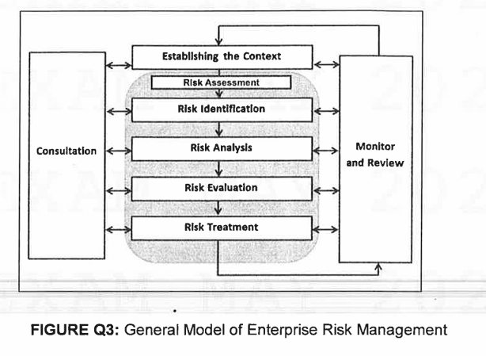
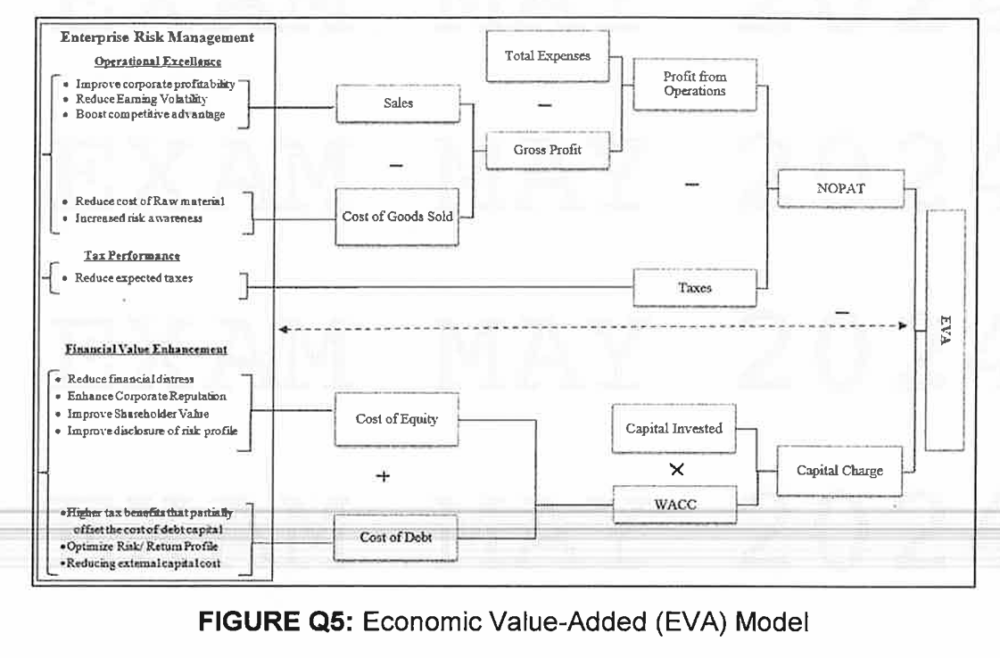

# FINAL EXAMINATION MAY 2024 SEMESTER

## COURSE: GEB3233 - ENTERPRISE RISK MANAGEMENT

## DATE: 31 JULY 2024 (WEDNESDAY)

## TIME: 2:30 PM - 5:30 PM (3 HOURS)

## INSTRUCTIONS TO CANDIDATES

1.  Answer ALL questions in the Answer Booklet.
2.  Begin EACH answer on a new page in the Answer Booklet.
3.  Indicate clearly answers that are cancelled, if any.
4.  Where applicable, show clearly steps taken in arriving at the solutions and indicate ALL assumptions, if any.
5.  DO NOT open this Question Booklet until instructed.

**Note:**
i. There are SIX (6) pages in this Question Booklet including the cover page.
ii. DOUBLE-SIDED Question Booklet.

---

### Question 1

There are various risk factors that facing the enterprise in the course of doing business. These risks factors can be grouped into larger categories. The enterprise needs to understand and actively manage them.

**a. Explain the following risks:**
**i. Operational Risk**
**ii. Financial Risk**
**iii. Market Risk**
**iv. Reputational Risk**
**v. Strategic Risk**
**[10 marks]**

**Answer:**

**i. Operational Risk:**
Operational risk refers to adverse unexpected developments resulting from internal processes, people, and systems, or from external events. It is the risk that impacts the day-to-day operations in executing actions and plans. Examples include risks related to quality control, hiring practices, IT system failures, human error, fraud, and supply chain disruptions.

**ii. Financial Risk:**
Financial risk encompasses variations to an organization's expected financial asset and financial liability values. These risks are externally derived and can be expressed in values on the balance sheet, income statement, or cash flow statement. Key examples include earnings risk, interest rate risk, investment risk, credit risk (the risk of default on a debt), and liquidity risk (the risk of being unable to meet short-term financial demands).

**iii. Market Risk:**
Market risk, also known as Systematic Risk, is the risk of a decrease in the value of investments due to changes in uncontrollable market factors that affect the entire market. These factors are beyond the control of an individual organization. Specific types of market risk include interest rate risk, equity risk (changes in stock prices), currency risk, and commodity risk.

**iv. Reputational Risk:**
Reputational risk is the threat or danger to the good name, standing, or reputation of a business. This risk can arise from a failure to meet the expectations of stakeholders, leading to a negative perception. It can be caused directly by the company's actions, indirectly by employees' actions, or tangentially through partners or suppliers. Poor reputation can lead to loss of customers, revenue, and market value.

**v. Strategic Risk:**
Strategic risk is the risk that can derail an enterprise's strategies and impede the achievement of its core objectives. It represents the most significant threats and opportunities that could affect an organization's ability to survive and thrive. These risks are often dynamic, interconnected, and influenced by external factors such as competition, regulatory changes, market shifts, and technological innovation.

---

**b. Compare TWO (2) risk response strategies.**
**[10 marks]**

**Answer:**

Two common risk response strategies are **Risk Avoidance** and **Risk Mitigation (Reduction)**. They differ fundamentally in their approach to handling an identified risk.

**1. Risk Avoidance (Avoid):**

- **Approach:** This is a strategy of elimination. It involves deciding not to start or to cease an activity in order to completely remove a particular risk. The goal is to reduce the chance of loss to zero. For example, a company might avoid the risks of operating in a politically unstable country by choosing not to enter that market.
- **Goal:** To completely prevent a loss exposure from being acquired or to abandon an existing one.
- **Applicability:** This strategy is suitable for high-impact, high-probability risks where the potential for loss is so great that no other response is acceptable. However, it is not always practical, as avoiding a risk may also mean foregoing a significant opportunity.

**2. Risk Mitigation (Reduce):**

- **Approach:** This strategy focuses on reducing the severity or likelihood of a risk. It does not eliminate the risk but seeks to control it to an acceptable level. This is achieved by implementing control measures. For example, installing a sprinkler system doesn't prevent a fire (avoidance), but it significantly reduces the damage (consequences) if one occurs. Similarly, employee safety training aims to reduce the likelihood of workplace accidents.
- **Goal:** To lower the probability or impact (or both) of a risk event to an acceptable threshold.
- **Applicability:** This is one of the most common strategies, applied to risks that cannot or should not be avoided. It is a proactive approach that involves a cost-benefit analysis to ensure the control measures are economically sensible.

**Comparison:**

| Feature              | Risk Avoidance                                                                   | Risk Mitigation (Reduction)                                                           |
| :------------------- | :------------------------------------------------------------------------------- | :------------------------------------------------------------------------------------ |
| **Objective**        | Eliminate the risk entirely.                                                     | Reduce the risk's likelihood or impact.                                               |
| **Outcome**          | The risk is no longer a factor.                                                  | The risk remains but at a lower, more manageable level.                               |
| **Opportunity Cost** | Can be very high; the potential benefits associated with the risk are also lost. | Lower; allows the organization to pursue the opportunity while managing its downside. |
| **Example**          | Not investing in a new product line due to market volatility.                    | Investing in the product line but hedging against currency fluctuations.              |

In summary, **Avoidance** is an absolute measure that removes the risk (and associated opportunity), while **Mitigation** is a control measure that manages the risk, allowing the enterprise to proceed with the activity in a safer manner.

---

### Question 2

The paradigm of corporate risk management has evolved from the traditional pure risk and financial risk management to a more holistic approach of enterprise risk management.

**a. Explain the concept of sustainability from the enterprise's managerial viewpoint.**
**[10 marks]**

**Answer:**

From an enterprise's managerial viewpoint, sustainability is a strategic approach that ensures the long-term viability and success of the business by balancing economic growth, environmental care, and social well-being. It is based on the foundational principle of "fulfilling the needs of current generations without compromising the needs of future generations," as defined by the Brundtland Commission.

For management, this translates into several key concepts:

1.  **Integration with Business Strategy:** Sustainability is not a separate corporate social responsibility (CSR) initiative but a core part of business strategy. It involves making decisions and conducting activities that meet the needs of the enterprise and its stakeholders today while protecting and enhancing the human and natural resources needed in the future.

2.  **Triple Bottom Line (3Ps):** The concept, popularized by John Elkington, moves beyond the traditional financial bottom line (Profit) to include social (People) and environmental (Planet) performance. Managers must consider how their operations impact all three areas. This holistic view helps in creating sustainable, long-term value.

3.  **Risk and Opportunity Management:** Sustainability presents both risks and opportunities. Environmental risks (e.g., climate change, resource scarcity) and social risks (e.g., labor practices, community relations) can have material financial impacts. Conversely, sustainable practices can create opportunities for innovation, cost savings (e.g., energy efficiency), brand enhancement, and access to new markets.

4.  **Stakeholder Engagement:** A managerial viewpoint on sustainability recognizes that a company's success depends on a wide range of stakeholders, not just shareholders. This includes employees, customers, suppliers, and the community. Managing these relationships effectively is crucial for long-term prosperity.

In essence, a modern managerial viewpoint sees sustainability as a framework for building a resilient, adaptive, and responsible organization that can thrive in a changing world by creating value for itself and society simultaneously.

---

**b. Determine how Environmental, Social and Governance (ESG) risks can be managed within enterprise risk management framework.**
**[10 marks]**

**Answer:**

Environmental, Social, and Governance (ESG) risks can be effectively managed by integrating them into a standard enterprise risk management (ERM) framework. This integration transforms traditional ERM into Enterprise Sustainability Risk Management (ESRM), ensuring that non-financial risks are identified, assessed, and treated with the same rigor as operational or financial risks. The process is as follows:

1.  **Risk Identification:**

    - The ERM process begins with identifying potential risks. For ESG, this means systematically looking for threats and opportunities in each category.
    - **Environmental:** Identifying risks like climate change impact on operations, regulatory changes regarding emissions, resource scarcity, and water management.
    - **Social:** Identifying risks related to labor practices, health and safety, diversity and inclusion, data privacy, and community relations. Poor management can lead to strikes, lawsuits, and reputational damage.
    - **Governance:** Identifying risks in board composition, executive compensation, bribery and corruption, and lack of transparency, which can undermine investor confidence.

2.  **Risk Assessment and Prioritization:**

    - Once identified, ESG risks must be assessed for their potential impact and likelihood, just like any other risk. A risk matrix can be used to evaluate and prioritize them.
    - **Impact:** The impact of an ESG risk can be financial (fines, loss of sales), reputational (brand damage), or operational (supply chain disruption). For example, allegations of forced labor (a social risk) can lead to product seizures by customs authorities, directly impacting revenue.
    - **Likelihood:** The probability of the risk materializing. This can be assessed through scenario analysis, stakeholder feedback, and monitoring regulatory trends.

3.  **Risk Response and Treatment:**

    - Based on the assessment, management develops response strategies.
    - **Mitigation:** Implementing controls to reduce the risk. For example, investing in cleaner technology to reduce emissions (Environmental), improving workplace safety protocols (Social), or strengthening anti-bribery policies (Governance).
    - **Acceptance:** Accepting low-impact risks that are within the firm's risk appetite.
    - **Transfer:** Using instruments like insurance for certain environmental liabilities.
    - **Avoidance:** Exiting a business line or market with unmanageable ESG risks.

4.  **Monitoring, Communication, and Reporting:**
    - The final step involves continuously monitoring the identified ESG risks and the effectiveness of the controls.
    - This includes tracking key ESG metrics (e.g., carbon footprint, employee turnover, diversity statistics) and reporting them to the board and external stakeholders. This transparency is a key part of the "Governance" pillar and helps build trust and accountability.

By embedding ESG into the ERM framework, an enterprise moves beyond a compliance-focused approach to proactively managing risks that are increasingly material to its long-term strategy, performance, and value creation.

---

### Question 3

The philosophy of enterprise risk management (ERM) addresses risk issues facing organization from holistic (enterprise-wide), integrated and strategic approaches. There are many iterations of ERM framework from the baseline model which encompasses the essential process of ERM. FIGURE Q3 below depicts a general model of enterprise risk management.

**FIGURE Q3: General Model of Enterprise Risk Management**

**a. Examine how the process of the above ERM model can assist enterprises to see risks from a strategic perspective in order to reap the benefits from them.**
**[10 marks]**

**Answer:**

The ERM model shown in FIGURE Q3, while representing a general process, inherently assists enterprises in viewing risks from a strategic perspective by linking each step to the organization's overarching goals. This strategic lens allows a company not only to mitigate threats but also to identify and capitalize on opportunities.

1.  **Establishing the Context:** This initial step is fundamentally strategic. It requires the enterprise to define its objectives, scope, and operating environment. By asking "What are we trying to achieve?", the organization immediately frames risk in relation to its strategic goals. This context includes defining the risk appetite, which is a strategic decision about how much risk the enterprise is willing to take to achieve its objectives. This prevents risk management from becoming a siloed, compliance-only activity.

2.  **Risk Identification:** From a strategic perspective, this step goes beyond identifying simple operational hazards. It involves scanning for internal and external uncertainties that could impact strategic objectives. This includes competitive threats, technological disruptions, regulatory changes, and market shifts. Critically, this step also involves identifying opportunities—positive risks—that could be exploited to gain a competitive advantage.

3.  **Risk Analysis and Evaluation:** This stage involves assessing the potential impact and likelihood of identified risks on strategic objectives. By analyzing which risks could most significantly derail strategy, the enterprise can prioritize its resources effectively. Evaluating risks against the pre-defined risk appetite allows for strategic decisions. A risk that might be unacceptable for one strategy could be a necessary and acceptable part of another, more aggressive growth strategy.

4.  **Risk Treatment:** The strategic viewpoint is crucial here. Risk treatment is not just about implementing controls to reduce threats. It also involves designing proactive strategies to seize opportunities. For example, if a potential technological disruption is identified, a strategic response might be to invest in R&D or acquire a tech startup, turning a threat into a competitive advantage. The choice of treatment (avoid, mitigate, transfer, accept) is a strategic decision based on a cost-benefit analysis in the context of the firm's goals.

5.  **Monitor and Review:** The business environment is dynamic, and so are strategic risks. This continuous feedback loop ensures that the risk management process remains aligned with the evolving strategy of the enterprise. It allows management to test assumptions, assess the effectiveness of its strategic risk responses, and adapt to new threats and opportunities as they emerge.

By following this process, an enterprise moves from a reactive, hazard-focused view of risk to a proactive, holistic, and strategic one, where managing uncertainty becomes an integral part of creating and preserving value.

---

**b. Compare the EIGHT (8) components of COSO ERM framework with the general ERM model as in FIGURE Q3 which may enhance the overall effectiveness of enterprise risk management.**
**[10 marks]**

**Answer:**

The COSO ERM framework provides a more structured and comprehensive approach than the general ERM model, enhancing effectiveness by explicitly integrating risk with governance, culture, and strategy. While the general model outlines a cyclical process, the COSO framework organizes this process within a broader organizational structure.

The original COSO ERM framework (2004) had eight components, which can be mapped to the general model, but the newer framework (2017) restructures these into five more strategic components. For the purpose of this question referencing the "eight components," we will use the well-established 2004 model.

**Mapping COSO's 8 Components to the General ERM Model:**

| General ERM Model Process Step              | Corresponding COSO ERM Component(s) (2004) | How COSO Enhances Effectiveness                                                                                                                                                                                                                                                                                           |
| :------------------------------------------ | :----------------------------------------- | :------------------------------------------------------------------------------------------------------------------------------------------------------------------------------------------------------------------------------------------------------------------------------------------------------------------------ |
| **(Foundation)**                            | 1. **Internal Environment**                | The general model lacks an explicit foundation. COSO establishes that **culture, ethics, and risk philosophy** are the bedrock of effective ERM. It ensures the "tone at the top" supports the entire risk process.                                                                                                       |
| **Establishing the Context**                | 2. **Objective Setting**                   | COSO explicitly requires that objectives be set _before_ risks can be identified. It links risk management directly to strategic, operational, reporting, and compliance objectives, ensuring alignment with the business.                                                                                                |
| **Risk Identification**                     | 3. **Event Identification**                | COSO differentiates between events that represent risks and those that represent opportunities, formally encouraging management to consider both the upside and downside of uncertainty.                                                                                                                                  |
| **Risk Assessment / Analysis / Evaluation** | 4. **Risk Assessment**                     | COSO formalizes this step by requiring assessment of both likelihood and impact, and considering risks on an inherent and residual basis. This adds a layer of analytical rigor.                                                                                                                                          |
| **Risk Treatment**                          | 5. **Risk Response**                       | COSO outlines specific response categories (avoiding, accepting, reducing, sharing) and requires that the response aligns with the organization's risk tolerances, providing a structured decision-making framework.                                                                                                      |
| **(Implementation)**                        | 6. **Control Activities**                  | The general model implies controls in "Risk Treatment," but COSO makes it an explicit component. It requires that policies and procedures are established and implemented to ensure risk responses are effectively carried out throughout the organization.                                                               |
| **Monitor and Review**                      | 8. **Monitoring**                          | Both models include monitoring. COSO emphasizes that monitoring can be done through ongoing management activities or separate evaluations, providing flexibility while ensuring the ERM process remains effective over time.                                                                                              |
| **(Cross-cutting Process)**                 | 7. **Information & Communication**         | While the general model has a "Communication & Consultation" step, COSO frames it as a pervasive component. It mandates that relevant information is identified, captured, and communicated up, down, and across the entity, ensuring that everyone has the information they need to fulfill their risk responsibilities. |

**Conclusion on Enhanced Effectiveness:**

The COSO framework enhances the general model's effectiveness in three key ways:

1.  **Structural Foundation:** It adds the foundational **Internal Environment** component, recognizing that no process can succeed without the right culture and governance.
2.  **Strategic Integration:** It more forcefully links the risk process to **Objective Setting**, ensuring that ERM is a strategic tool, not just an operational one.
3.  **Holistic & Pervasive Elements:** It treats **Information & Communication** and **Control Activities** as distinct, critical components that support the entire process, making the framework more robust and actionable across all levels of the enterprise.

---

### Question 4

Corporations used to see the primary goals for its existence from a single bottom line perspective. As time evolves, with the heighten expectations from other major stakeholders (as opposed to mere shareholders) and regulators, it entails corporations to shift their priority paradigm to triple bottom line objectives.

**a. Determine how corporate governance and risk governance are vital for corporations to meet their triple bottom line objectives.**
**[10 marks]**

**Answer:**

Corporate governance and risk governance are vital for meeting triple bottom line objectives—**Profit, People, and Planet**—because they provide the necessary structure, accountability, and processes to manage performance and risks across all three dimensions, not just the financial one.

**1. Role of Corporate Governance:**
Corporate governance is the system of rules, practices, and processes by which a company is directed and controlled. Its vitality for the triple bottom line lies in:

- **Broadening Accountability:** It extends the board's and management's accountability beyond shareholders (Profit) to a wider group of stakeholders, including employees, customers (People), and the community (Planet). This ensures that social and environmental objectives are given strategic importance.
- **Setting the 'Tone at the Top':** Strong corporate governance establishes an ethical culture that values social responsibility and environmental stewardship. The board of directors, through its oversight role, ensures that these values are integrated into the company's strategy and decision-making.
- **Ensuring Transparency and Disclosure:** It mandates transparent reporting on all three bottom lines. This allows stakeholders to assess the company's performance on environmental and social metrics, holding the corporation accountable for its commitments.

**2. Role of Risk Governance:**
Risk governance is the framework embedded within the corporate culture and processes to ensure that risk management is effective. It is the practical application of corporate governance principles to the management of uncertainty. Its vitality lies in:

- **Identifying a Broader Spectrum of Risks:** Effective risk governance ensures the identification of risks that threaten all three bottom lines. This includes environmental risks (e.g., climate change), social risks (e.g., labor violations, community impact), and traditional financial risks. Without this, non-financial risks that could severely impact reputation and long-term value might be ignored.
- **Embedding Risk Management into the Culture:** It ensures that managing risks to People and Planet is not just a function of a specific department but is part of the responsibilities of every employee and integrated into all business processes.
- **Informing Strategic Decisions:** By providing the board and management with a comprehensive view of risks across the triple bottom line, risk governance enables more informed strategic planning. It helps the corporation to navigate the trade-offs between Profit, People, and Planet and to identify opportunities for creating value in all three areas (e.g., investing in sustainable technologies that also reduce costs).

In conclusion, corporate governance sets the strategic direction and accountability for the triple bottom line, while risk governance provides the operational framework to proactively manage the associated risks and opportunities, making the achievement of these broader objectives possible.

---

**b. Appraise the efficacy of risk assessment (evaluation) methodology or matrix in determining which risk factors to be prioritized for mitigation strategy.**
**[10 marks]**

**Answer:**

The risk assessment matrix is a widely used methodology for evaluating and prioritizing risks, and its efficacy lies in its simplicity and ability to facilitate structured discussion. However, it also has significant limitations that must be understood for it to be used effectively.

**Efficacy and Strengths:**

1.  **Prioritization Tool:** The primary strength of the risk matrix is its function as a prioritization tool. By plotting risks based on two simple dimensions—**likelihood** (frequency) and **consequence** (impact)—it provides a clear visual ranking. Risks falling into the "high-likelihood, high-consequence" (red) zone are immediately identified as top priorities for mitigation.
2.  **Facilitates Communication:** The matrix provides a common language and framework for managers from different parts of the business to discuss and compare diverse risks (e.g., financial, operational, reputational) on a consistent basis. This helps in building consensus on which risks require immediate attention and resources.
3.  **Defines Risk Appetite:** The coloring of the matrix (e.g., red for unacceptable, yellow for ALARP - As Low As Reasonably Practicable, green for acceptable) serves as a practical definition of the organization's risk appetite, guiding decisions on whether a risk needs to be treated.

**Weaknesses and Limitations:**

Despite its usefulness, the efficacy of the risk matrix is limited by several inherent weaknesses, as highlighted by risk management research:

1.  **Poor Resolution and "Risk Ties":** The use of discrete categories (e.g., 5x5 matrix) means that many different risks can be assigned the same score or placed in the same cell. This makes it difficult to distinguish between the relative priority of these "tied" risks, potentially leading to suboptimal resource allocation.
2.  **Ambiguity of Definitions:** The qualitative labels used for categories (e.g., "unlikely," "moderate," "severe") are often vague and subjective. Different individuals can interpret these terms differently, leading to inconsistent assessments across the organization. Without anchoring these terms to clear, quantitative ranges, the results can be unreliable.
3.  **Scaling Issues:** Many matrices use linear scales, which do not accurately reflect the nature of risk, where consequences and likelihoods can span several orders of magnitude. A logarithmic scale is often more appropriate but is less intuitive and rarely used in practice. This can lead to an underestimation of low-probability, high-consequence events.
4.  **Implicit and Unintended Bias:** The design and coloring of the matrix can create implicit biases. For example, a simple diagonal coloring scheme may not adequately reflect a desire for "major hazard aversion," where high-consequence events are treated more seriously even if their probability is low.

**Appraisal Conclusion:**

The risk assessment matrix is an **effective qualitative tool for initial risk screening and facilitating high-level prioritization discussions**. Its simplicity is both its greatest strength and its greatest weakness. For an enterprise, its efficacy is high when used to start conversations, build a common understanding of the risk landscape, and make broad decisions about which risks fall into acceptable or unacceptable categories.

However, its efficacy is **low** when used as a precise, quantitative, or definitive ranking tool. It should not be the sole basis for making complex or high-stakes mitigation decisions. For critical risks, the initial assessment from a matrix should be followed by more detailed quantitative analysis to overcome its inherent limitations.

---

### Question 5

Economic Value Added (EVA), also known as economic profit, is a measure of return generated beyond the basic accounting profit as well as over and above investors' required rate of return. Figure Q5 below depicts the Economic Value-Added (EVA) model of enterprise value creation.

Based on FIGURE Q5 above, appraise in details how an effective implementation of enterprise risk management can create value for the firm along the line of the Economic Value-Added (EVA) model in the context of:

**a. operational excellence**
**[10 marks]**

**Answer:**

An effective implementation of Enterprise Risk Management (ERM) creates significant value through operational excellence, which directly impacts the top half of the Economic Value-Added (EVA) model, specifically by increasing the **Net Operating Profit After Tax (NOPAT)**. The EVA model shows NOPAT is derived from `Sales - Cost of Goods Sold - Other Expenses - Taxes`. ERM enhances this through several mechanisms:

1.  **Improve Corporate Profitability (Increasing Sales and Reducing Costs):**

    - **Informed Risk-Taking:** ERM provides a framework for taking calculated risks, allowing the company to pursue opportunities that can increase sales and market share. By understanding the associated risks, the company can make better strategic decisions about which markets to enter or products to launch.
    - **Reducing Unexpected Losses:** Proactive identification and mitigation of operational risks (e.g., supply chain disruptions, equipment failure, human error) reduce unexpected costs and downtime. This ensures smoother operations, protects revenue streams, and lowers the Cost of Goods Sold.

2.  **Reduce Earnings Volatility:**

    - Volatility in earnings is penalized by investors and can increase the cost of capital. ERM smooths earnings by identifying and managing risks that could cause sudden dips in performance. For example, by hedging against commodity price fluctuations or currency risk, a company can create more predictable and stable cash flows. This stability and predictability are highly valued by the market and contribute to a more robust NOPAT over time.

3.  **Boost Competitive Advantage:**

    - A company with a mature ERM program is more resilient and agile. It can respond more quickly to market changes and disruptions than its competitors. This resilience can be a significant competitive advantage, allowing it to capture market share during times of crisis when others falter. This directly supports sustainable sales and profitability.

4.  **Reduce Expected Taxes (A Component of NOPAT):**
    - By managing risks more effectively, a company can optimize its structure and financial decisions. For instance, a better understanding of risks allows for more efficient use of debt, which has tax advantages (interest is tax-deductible). Furthermore, avoiding large, unexpected losses or fines from regulatory non-compliance (a key focus of ERM) prevents unexpected increases in the effective tax rate.

In appraisal, ERM is not just a defensive mechanism. It is a performance-enhancing tool that drives operational excellence by enabling better decision-making, increasing resilience, reducing costs, and stabilizing profits, all of which are critical components for maximizing NOPAT and, consequently, EVA.

---

**b. financial value enhancement**
**[10 marks]**

**Answer:**

Effective ERM implementation creates value through financial value enhancement by directly addressing the bottom half of the EVA model. The core of this is **reducing the firm's capital charge**, which is calculated as `Capital Invested * Weighted Average Cost of Capital (WACC)`. A lower capital charge, for a given NOPAT, results in higher EVA. ERM achieves this by lowering the WACC.

1.  **Reduce Financial Distress and Improve Shareholder Value:**

    - The most significant way ERM enhances financial value is by lowering the perceived risk of the company. A company with a robust ERM program is seen as less likely to suffer from catastrophic events or financial distress. This reduction in overall firm-specific risk leads investors and lenders to demand a lower risk premium.
    - **Lower Cost of Equity:** Shareholders perceive the company's future cash flows as more stable and certain. They therefore require a lower rate of return, reducing the cost of equity.
    - **Lower Cost of Debt:** Lenders and rating agencies view the company as more creditworthy. This results in better credit ratings and lower interest rates on debt, reducing the cost of debt.
    - Both of these factors directly lower the WACC.

2.  **Enhance Corporate Reputation and Improve Disclosure:**

    - A mature ERM program involves transparent and comprehensive disclosure of how the company manages its risks. This improved disclosure reduces **information asymmetry** between management and investors. When investors have a clearer understanding of the company's risk profile and how it is being managed, uncertainty is reduced. This increased confidence and trust also contribute to a lower cost of capital (WACC). An enhanced reputation makes the firm a more attractive investment.

3.  **Optimize Risk/Return Profile and Capital Allocation:**

    - ERM provides a framework for optimizing the use of capital. By understanding the risk-adjusted return of different projects and investments, management can allocate capital more efficiently to ventures that generate the highest returns for a given level of risk. This ensures that the "Capital Invested" component of the EVA calculation is deployed effectively, maximizing the potential for economic profit.

4.  **Optimizing Capital Structure:**
    - As shown in the model, ERM helps in managing the balance between cost of equity and cost of debt. By effectively managing operational and financial risks, a company might be able to take on more debt (which is generally cheaper and offers a tax shield) without unduly increasing its risk of financial distress, thereby optimizing its capital structure and lowering its overall WACC.

In appraisal, ERM's role in financial value enhancement is profound. By systematically managing risks, ERM reduces the actual and perceived riskiness of the firm, leading to a direct reduction in its WACC. This reduction in the cost of capital is a powerful lever for increasing EVA and creating significant shareholder value.

**-END OF PAPER-**
