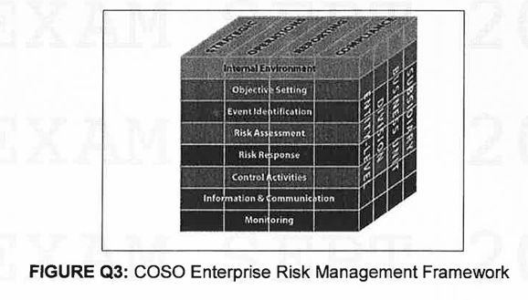

## Universiti Teknologi PETRONAS - Final Examination: September 2024 Semester

### Course Details:

- **Course:** GEB3233/GFB3233 - Enterprise Risk Management
- **Date:** 6 December 2024 (Friday)
- **Time:** 9:00 AM - 12:00 NOON (3 Hours)

### Instructions to Candidates:

1.  Answer ALL questions in the Answer Booklet.
2.  Begin EACH answer on a new page in the Answer Booklet.
3.  Indicate clearly answers that are cancelled, if any.
4.  Where applicable, show clearly steps taken in arriving at the solutions and indicate ALL assumptions, if any.
5.  DO NOT open this Question Booklet until instructed.

### Note:

- There are SIX (6) pages in this Question Booklet including the cover page.
- DOUBLE-SIDED Question Booklet.

---

### Question 1: Understanding Risk in Business Activities

The purpose of engaging in business activities is to generate additional return above the risk-free rate for the capital invested. Nonetheless, generating return above the risk-free rate from business activities is a risky effort. Its success is not a certain matter.

**a. Distinguish the concept of 'risk' from 'uncertainty'.**
[5 marks]

**Answer:**

Risk and uncertainty are related but distinct concepts that are fundamental to risk management. The key distinction lies in the ability to quantify and predict outcomes.

- **Risk** refers to a state of incomplete knowledge where potential outcomes can be identified and their probabilities can be reasonably estimated. According to the ISO 31000 standard, risk is defined as "the effect of uncertainty on objectives." This effect can be positive (an opportunity), negative (a threat), or simply a deviation from what is expected. In financial and business contexts, risk involves familiar variables that can be quantified, such as market volatility or the probability of a project delay. Because it can be measured, risk can be managed through tools like insurance, derivatives, and strategic controls.

- **Uncertainty** refers to a state where potential outcomes or their probabilities cannot be known or reasonably estimated. It represents new, uncharted territory. The ERM Guide (2009) defines uncertainty as "incomplete knowledge." This can manifest as event uncertainty (not knowing if an event will occur), variability uncertainty (natural variations in outcomes), or systemic uncertainty arising from complex, interconnected factors. The current global environment, with its simultaneous economic, geopolitical, and environmental shifts, is characterized by a high degree of uncertainty, making outcomes very difficult to quantify or predict.

In summary, the primary difference is measurability: **risk is measurable uncertainty, while uncertainty itself is not.**

---

**b. Define the following risks:**
**i. pure risk**
**ii. speculative risk**
**iii. systematic risk**
**iv. diversifiable risk**
**v. enterprise risk**
[10 marks]

**Answer:**

i. **Pure Risk:** Refers to situations that involve only the chance of loss or no loss. There is no possibility of financial gain. These risks are typically insurable. Examples include natural disasters (fire, flood), property damage, or accidents resulting in liability.

ii. **Speculative Risk:** Refers to situations where there is a possibility of either gain or loss. These risks are undertaken voluntarily in the pursuit of profit. Examples include investing in the stock market, launching a new product, or making real estate investments. These risks are generally not insurable.

iii. **Systematic Risk:** Also known as market risk or non-diversifiable risk, this is risk inherent to the entire market or market segment. It is caused by external factors that affect all companies, such as changes in interest rates, inflation, geopolitical events, or economic recessions. This type of risk cannot be eliminated through portfolio diversification.

iv. **Diversifiable Risk:** Also known as unsystematic or firm-specific risk, this risk is specific to an individual company or industry. It arises from internal factors such as management decisions, labor strikes, or a failed product launch. This type of risk can be significantly reduced or eliminated by holding a well-diversified portfolio of assets.

v. **Enterprise Risk:** A holistic concept that encompasses all risks—strategic, project, and operational—that an organization faces in pursuit of its objectives. It integrates the management of all categories of risk (including pure, speculative, systematic, and diversifiable) to provide a comprehensive, enterprise-wide view. This allows an organization to understand how a specific operational risk, if severe enough, could escalate and become a strategic threat to the entire enterprise.

---

**c. Analyze the difference in objective emphasis between single bottom line and triple bottom line perspective in undertaking business activities.**
[5 marks]

**Answer:**

The difference in objective emphasis between the single and triple bottom line perspectives represents a fundamental shift in how business success is measured.

- **Single Bottom Line (SBL):** This is the traditional financial perspective where the ultimate objective is maximizing shareholder wealth. Success is measured solely by financial performance, specifically the "bottom line" on the income statement, which is **profit** (Net Income). All business decisions are driven by their potential to increase revenue, reduce costs, and ultimately deliver the highest possible financial return to shareholders. This approach often views social and environmental costs as external factors to be minimized only when required by law or when it directly impacts profitability.

- **Triple Bottom Line (TBL):** This perspective broadens the definition of success to include social and environmental performance alongside financial performance. The TBL framework argues that a company's long-term value and sustainability depend on its performance across three key pillars:
  1.  **Profit (Economic):** The traditional measure of financial performance.
  2.  **People (Social):** The company's impact on its stakeholders, including employees, customers, and the community. This involves fair labor practices, ethical conduct, and community engagement.
  3.  **Planet (Environmental):** The company's impact on the natural environment. This includes managing its carbon footprint, resource consumption, and pollution.

The objective emphasis shifts from a narrow focus on **shareholder value** to a broader, more sustainable focus on **stakeholder value**. The TBL perspective recognizes that long-term profitability is intrinsically linked to social and environmental responsibility, and that ignoring these aspects creates significant risks to the enterprise.

---

### Question 2: Sustainability and ESG Practices

Nowadays, the notion of sustainability has taken root in business management. The concept of sustainability can be aligned to the United Nation's 17 sustainable development goals (SDGs) and their managerial emphasis is manifested in corporations' environmental, social and governance (ESG) practices.

**a. Define ESG practices.**
[5 marks]

**Answer:**

ESG (Environmental, Social, and Governance) practices refer to a framework of non-financial criteria that stakeholders, including investors, use to assess a company's performance, risk profile, and ethical impact. It provides a way to evaluate a company's operations beyond its traditional financial balance sheet by looking at its impact on the broader society and its long-term sustainability. The three pillars are:

1.  **Environmental (E):** This pillar assesses how a company performs as a steward of the natural environment. Practices include managing climate change risks, reducing carbon emissions, efficient use of water and natural resources, and managing waste and pollution.
2.  **Social (S):** This pillar examines how a company manages relationships with its employees, suppliers, customers, and the communities where it operates. Practices include ensuring fair labor standards, promoting diversity and inclusion, protecting customer data privacy, and upholding human rights.
3.  **Governance (G):** This pillar deals with a company’s leadership, internal controls, audits, shareholder rights, and overall accountability. Practices include maintaining an independent board of directors, transparent executive compensation policies, and strong anti-corruption measures.

---

**b. Explain how the ESG practices are related to a company's triple bottom line.**
[5 marks]

**Answer:**

ESG practices are the operational manifestation of the Triple Bottom Line (TBL) philosophy. While the TBL provides the theoretical framework of "Profit, People, and Planet," ESG provides the specific, measurable criteria used to evaluate a company's performance against that framework. The relationship is as follows:

- **Planet (TBL) corresponds to Environmental (ESG):** The "E" in ESG directly measures a company's performance in relation to the "Planet" pillar. Metrics on carbon emissions, water usage, and waste management provide tangible data on a company's environmental impact.

- **People (TBL) corresponds to Social (ESG):** The "S" in ESG aligns with the "People" pillar. It assesses how a company treats its employees, interacts with its community, and serves its customers, which are the core components of the social dimension of the TBL.

- **Profit (TBL) is supported by Governance (ESG):** While "Profit" is the economic pillar, the "G" in ESG is the enabling structure that ensures this profit is achieved sustainably and ethically. Strong governance—including board oversight, internal controls, and transparency—is essential for managing risks, making sound long-term decisions, and maintaining the trust of stakeholders, all of which are critical for sustainable profitability. Poor governance can destroy value, even in a financially profitable company.

In essence, ESG operationalizes the TBL by providing a structured set of practices and metrics that allow companies to manage, measure, and report on their performance across all three dimensions of sustainability.

---

**c. Discuss how the ESG risks can impact corporations' business performance.**
[10 marks]

**Answer:**

ESG risks, which are non-financial in nature, can have a significant and direct impact on a corporation's business performance, affecting its financial stability, reputation, and long-term viability. The impact can be discussed across the three pillars:

1.  **Environmental Risks:**

    - **Physical Risks:** Climate change can lead to physical damage to assets from extreme weather events (e.g., floods, storms), disrupting supply chains and operations, and increasing insurance costs.
    - **Transition Risks:** The shift to a low-carbon economy creates regulatory and market risks. Companies may face carbon taxes, stricter emissions standards, or changing consumer preferences for sustainable products. Failure to adapt can lead to stranded assets (e.g., coal-fired power plants), loss of market share, and higher operating costs.
    - **Example:** In Malaysia, companies in the oil palm sector have faced international scrutiny and product restrictions due to deforestation concerns, impacting their market access and performance.

2.  **Social Risks:**

    - **Human Capital Risks:** Poor labor practices, unsafe working conditions, or lack of diversity can lead to high employee turnover, strikes, and difficulty attracting talent. This directly impacts productivity and innovation.
    - **Reputational Risks:** Allegations of forced labor, human rights abuses in the supply chain, or data privacy breaches can cause severe reputational damage. This can lead to consumer boycotts, loss of customers, and regulatory fines.
    - **Example:** The case of Equifax demonstrates how poor management of social risk (data privacy) led to a massive data breach, resulting in enormous financial penalties, loss of customer trust, and a dramatic fall in its stock price. Similarly, several Malaysian glove manufacturers were banned from the US market due to allegations of forced labor.

3.  **Governance Risks:**
    - **Accountability and Fraud Risks:** Weak governance, such as a lack of board independence, poor internal controls, or unethical leadership, creates opportunities for fraud and corruption.
    - **Financial Impact:** These failures undermine investor confidence, increase the cost of capital, and can lead to catastrophic financial scandals and corporate collapse.
    - **Example:** The 1MDB scandal in Malaysia is a prime example of a catastrophic governance failure. The lack of oversight and internal controls allowed for massive fraud, leading to enormous debt, international investigations, severe reputational damage to the country, and the prosecution of top officials.

In conclusion, ESG risks are not peripheral concerns; they are material business risks that can destroy shareholder value, disrupt operations, and threaten a corporation's very existence. Proactively managing these risks is essential for sustainable business performance.

---

### Question 3: Enterprise Risk Management (ERM) Framework

The concept of enterprise risk management (ERM) emphasizes managing enterprise risk from holistic, enterprise-wide, integrated and strategic approaches within the business risk taking context.

**a. Analyze how ERM can become a strategic managerial approach to add value to corporation by comparing the silo versus holistic approach to managing and treating enterprise risk.**
[10 marks]

**Answer:**

ERM adds significant value to a corporation by shifting from a fragmented, defensive "silo" approach to a strategic, integrated "holistic" approach. This transformation turns risk management from a cost center into a value-creating function.

**The Silo Approach (Traditional Risk Management):**
In a silo approach, risks are managed independently within different departments or functions (e.g., Finance manages financial risk, IT manages cyber risk, Operations manages safety risk). This approach is characterized by:

- **Fragmentation:** Each department uses its own methods and language for risk, with little communication or coordination between them.
- **Lack of Integration:** It fails to identify interconnected risks. For instance, a supply chain risk (Operations) could have major financial implications (Finance) and reputational damage (Marketing), but these connections are missed.
- **Reactive and Defensive:** The focus is often on preventing losses and buying insurance for known, pure risks. It is not typically integrated with strategic planning.
- **Value Destruction:** This approach is inefficient, creates dangerous gaps in risk oversight, duplicates effort, and fails to identify enterprise-wide opportunities. It treats risk purely as a negative to be avoided.

**The Holistic Approach (ERM):**
A holistic approach, as embodied by ERM, views risk across the entire enterprise. It is a top-down, strategy-focused process characterized by:

- **Integration:** It establishes a common framework, language, and methodology for managing risk across all departments. This allows the organization to see how risks in one area can impact others.
- **Strategic Alignment:** ERM is fundamentally linked to the company's strategic objectives. Risks are identified and prioritized based on their potential to impact the achievement of those objectives. This ensures that resources are focused on the most critical threats and opportunities.
- **Proactive and Forward-Looking:** ERM is not just about preventing loss; it's about making better decisions to achieve objectives. It involves identifying emerging risks and seizing opportunities by understanding the organization's risk-reward balance.
- **Value Creation:** The holistic approach adds value in several key ways:
  1.  **Improved Decision-Making:** By providing a comprehensive view of risk, it enables the board and management to make more informed strategic decisions and take calculated risks.
  2.  **Increased Robustness and Flexibility:** The organization becomes more resilient to shocks and better able to adapt to a changing environment.
  3.  **Efficient Capital Allocation:** A better understanding of the risk-reward profile allows for more efficient allocation of capital, leading to a lower cost of capital and higher returns (Economic Value Added).
  4.  **Enhanced Stakeholder Confidence:** A transparent and robust ERM framework builds trust with investors, regulators, and customers, which can improve stock performance and brand reputation.

In conclusion, by breaking down silos and embedding risk management into the strategic fabric of the organization, the holistic ERM approach transforms risk management from a compliance-driven, fragmented activity into a powerful strategic tool that creates, preserves, and realizes value.

---

**b. FIGURE Q3 below depicts COSO's ERM framework in three dimensions, i.e. organizational objectives, ERM components and business organization levels. Appraise the interrelationship of these three dimensions with their corresponding elements.**
[10 marks]

> 

**Answer:**

The COSO ERM framework's three-dimensional "cube" model illustrates the critical interrelationships required for effective enterprise risk management. It shows how a set of ERM components should be applied to all organizational objectives at every level of the entity.

**The Three Dimensions:**

1.  **Organizational Objectives (Top Face):** This dimension represents the "what"—the strategic goals an organization strives to achieve. COSO categorizes these into four areas:

    - **Strategic:** High-level goals aligned with and supporting the mission.
    - **Operations:** Effective and efficient use of resources.
    - **Reporting:** Reliability of internal and external reporting.
    - **Compliance:** Adherence to applicable laws and regulations.

2.  **ERM Components (Front Face):** This dimension represents the "how"—the actions and processes required to achieve the objectives. The 2017 framework organizes these into five interrelated components (though the image might show the original eight):

    - **Governance & Culture:** The foundation, setting the tone from the top.
    - **Strategy & Objective-Setting:** Integrating ERM with strategic planning.
    - **Performance:** The core activities of identifying, assessing, and responding to risk.
    - **Review & Revision:** Monitoring and improving the ERM process.
    - **Information, Communication & Reporting:** The continuous flow of risk information.

3.  **Business Organization Levels (Side Face):** This dimension represents the "where"—the different levels of the organization's structure to which ERM must be applied. This includes:
    - **Entity-Level:** The entire organization.
    - **Division:** A major operating segment.
    - **Business Unit:** A specific unit within a division.
    - **Subsidiary:** A separate legal entity.

**Interrelationship and Appraisal:**

The power of the COSO framework lies in its depiction of the interrelationship between these three dimensions. It is not enough to have strong ERM components if they are not applied consistently.

- **Pervasive Application:** The framework demonstrates that every ERM component (e.g., Risk Assessment) must be applied to every organizational objective (e.g., Strategic growth) at every level of the organization (e.g., from the corporate Entity-Level down to a specific Business Unit).

- **Strategic Alignment:** The cube visually reinforces that risk management is not a standalone function. For example, when setting a **Strategic** objective like entering a new market, the organization must perform a **Risk Assessment** (Performance component) not just at the **Entity-Level**, but also within the specific **Division** or **Subsidiary** responsible for that market entry. This assessment must consider potential impacts on **Operations**, **Reporting**, and **Compliance** objectives.

- **Holistic View:** This interconnected structure ensures a holistic, 360-degree view of risk. A failure in a single component (e.g., weak Information & Communication) at one level (e.g., a Business Unit) can jeopardize a key objective (e.g., Operational efficiency) for the entire entity. Conversely, a strong application of the components provides assurance to the board that risks are being managed effectively across the whole organization in pursuit of its goals.

In essence, the framework's interrelationship shows that effective ERM is a cohesive, integrated system where all parts must work together. An organization can achieve its strategic objectives only when its risk management activities are consistently and comprehensively applied throughout its entire structure.

---

### Question 4: Business Continuity Management (BCM)

The Murphy's law states that "Anything that can go wrong will go wrong". Many unexpected negative occurrences have adversely impacted the smooth running of business operations, hence causing huge monetary as well as non-monetary losses to organizations.

**a. Explain the objectives of business continuity management (BCM).**
[5 marks]

**Answer:**

Business Continuity Management (BCM) is a proactive management process that identifies potential threats to an organization and the impacts to business operations those threats, if realized, might cause. The primary objective of BCM is to build organizational resilience with the capability for an effective response that safeguards the interests of its key stakeholders, reputation, brand, and value-creating activities.

The core objectives are:

1.  **Maintain Critical Operations:** To ensure the continuous delivery of critical products and services to customers at an acceptable predefined level following a disruptive incident.
2.  **Minimize Disruption and Impact:** To minimize the duration and impact of a disruption, thereby reducing financial losses, operational downtime, and damage to assets.
3.  **Protect Reputation and Brand:** To protect the organization's reputation and brand image by demonstrating competence and control during a crisis.
4.  **Ensure a Timely and Orderly Recovery:** To provide a planned and rehearsed method for restoring the business to its full operational capacity.
5.  **Meet Legal and Regulatory Obligations:** To ensure compliance with statutory and regulatory requirements for operational resilience.

---

**b. Develop the steps for implementing and maintaining a successful BCM program in organizations.**
[10 marks]

**Answer:**

Implementing and maintaining a successful BCM program is a cyclical process that follows a structured, multi-step approach, often aligned with standards like ISO 22301.

1.  **Policy and Program Management:**

    - **Establish Policy:** Secure top management commitment and establish a formal BCM policy that defines the program's scope, objectives, and governance structure.
    - **Allocate Roles:** Appoint a BCM manager and form a cross-functional committee to oversee the program.

2.  **Analysis:**

    - **Business Impact Analysis (BIA):** This is the cornerstone of BCM. Identify the organization's critical business processes and the resources they depend on. Determine the impact of a disruption to these processes over time, establishing the **Recovery Time Objective (RTO)**—the maximum tolerable downtime for each process.
    - **Risk Assessment:** Identify potential threats (e.g., natural disasters, cyberattacks, supply chain failures) that could cause a disruption and assess their likelihood and impact on critical processes.

3.  **Design and Strategy Development:**

    - **Develop Strategies:** Based on the BIA and risk assessment, design continuity strategies to meet the RTOs. This could include strategies for people (e.g., remote work), facilities (e.g., alternate sites), technology (e.g., data backups, failover systems), and suppliers (e.g., alternate suppliers).
    - **Select Solutions:** Choose cost-effective solutions that provide the required level of resilience.

4.  **Implementation:**

    - **Develop Business Continuity Plans (BCPs):** Create detailed, actionable plans that document the procedures to be followed during a disruption. These plans should outline response teams, contact lists, and step-by-step instructions for recovery.
    - **Develop Crisis Management and Communication Plans:** Establish a clear plan for managing the crisis at a strategic level and communicating effectively with all stakeholders (employees, customers, media, regulators).

5.  **Validation (Testing and Exercising):**

    - **Test the Plans:** A plan that is not tested cannot be trusted. Regularly conduct exercises to validate the BCPs, ranging from simple tabletop walkthroughs to full-scale simulations.
    - **Identify Gaps:** Use the results of tests to identify weaknesses in the plans and strategies and to provide training for response teams.

6.  **Maintenance and Review:**
    - **Continuous Improvement:** BCM is not a one-time project. The program must be regularly reviewed and updated to reflect changes in the business, technology, and threat landscape.
    - **Embed in Culture:** Integrate BCM into the organization's culture through ongoing awareness campaigns and training, ensuring it becomes part of "the way we do business."

---

**c. Discuss TWO (2) business case examples where BCM would have mitigated the business disruption and negative repercussion from their occurrence.**
[5 marks]

**Answer:**

1.  **The COVID-19 Pandemic:**

    - **Scenario:** A global professional services firm.
    - **Without BCM:** A firm without a BCM program would have been caught unprepared by the sudden shift to remote work. It would face chaos in deploying IT infrastructure, securing data, managing remote teams, and maintaining client service levels, leading to significant productivity loss, security breaches, and client attrition.
    - **With BCM:** A firm with a robust BCM program would have had a pre-existing and tested pandemic plan. This plan would include protocols for remote work, secure VPN access for all employees, and clear communication strategies. As a result, the firm could transition to a fully remote operating model within days, ensuring minimal disruption to client services, protecting employee health, and maintaining business performance while competitors struggled.

2.  **A Major Cloud Service Provider Outage:**
    - **Scenario:** An e-commerce company heavily reliant on a single cloud provider like Amazon Web Services (AWS) for its website, payment processing, and customer data.
    - **Without BCM:** A major regional outage of AWS would take the company's entire online presence offline. Without a continuity plan, the company would be completely helpless, losing sales every minute, suffering immense reputational damage from customer complaints, and potentially losing customer data permanently.
    - **With BCM:** A company with a mature BCM program would have designed its IT architecture for resilience. Its strategy might include a multi-cloud or hybrid-cloud approach, with critical data and applications replicated in a secondary provider (e.g., Microsoft Azure). Upon an AWS outage, the BCM plan would trigger an automated failover to the secondary site, restoring service within its Recovery Time Objective (e.g., under 15 minutes). This would mitigate the financial loss and protect customer trust and brand reputation.

---

### Question 5: ERM Framework and Value Creation

Enterprise risk management (ERM) framework can be theorized for the causal relationships of business risk that strategically associated with firms' business performance and cost of capital. ERM framework can be applied especially to the notion of managing firms' unsystematic (specific) risk that leads to the enhancement of shareholders' value as well as to meet other stakeholders' expectation.

**a. Model how the Severity-Likelihood risk assessment matrix can be used to rank enterprise risks as well as to prioritize their risk management strategy.**
[10 marks]

**Answer:**

The Severity-Likelihood risk assessment matrix is a core tool in ERM used to qualitatively rank and prioritize risks, thereby guiding the selection of appropriate risk management strategies.

**Modeling the Matrix:**

The model is a grid with two axes:

1.  **Y-axis (Severity/Impact):** Measures the potential consequence or damage if the risk event occurs. This is typically rated on a scale, for example, 1 (Insignificant) to 5 (Catastrophic).
2.  **X-axis (Likelihood/Probability):** Measures the probability of the risk event occurring within a specific timeframe. This is also rated on a scale, for example, 1 (Rare) to 5 (Almost Certain).

A **risk score** is calculated for each identified risk, often by multiplying the Severity and Likelihood scores (e.g., Score = Severity x Likelihood).

**Example of a 5x5 Risk Matrix Model:**

| **Likelihood** ↓ / **Severity** → | **1** (Insignificant) | **2** (Minor) | **3** (Moderate) | **4** (Major) | **5** (Catastrophic) |
| :-------------------------------- | :-------------------: | :-----------: | :--------------: | :-----------: | :------------------: |
| **5** (Almost Certain)            |           5           |      10       |        15        |      20       |          25          |
| **4** (Likely)                    |           4           |       8       |        12        |      16       |          20          |
| **3** (Possible)                  |           3           |       6       |        9         |      12       |          15          |
| **2** (Unlikely)                  |           2           |       4       |        6         |       8       |          10          |
| **1** (Rare)                      |           1           |       2       |        3         |       4       |          5           |

**Ranking and Prioritization:**

The risk scores are used to rank risks and are typically mapped to color-coded risk levels to visualize priority:

- **Extreme Risk (Red Zone, e.g., Scores 15-25):** Highest priority. These risks are unacceptable and require immediate, senior-level attention and urgent treatment plans.
- **High Risk (Orange Zone, e.g., Scores 8-12):** Significant risks that require senior management attention and dedicated treatment plans to reduce them to an acceptable level.
- **Medium Risk (Yellow Zone, e.g., Scores 4-6):** Risks that should be managed through specific monitoring and standard operational procedures.
- **Low Risk (Green Zone, e.g., Scores 1-3):** Acceptable risks that can be managed by routine procedures and may not require specific treatment beyond existing controls.

**Prioritizing Risk Management Strategy:**

The risk ranking directly informs the choice of risk treatment strategy:

1.  **Avoid:** For Extreme risks, the organization may decide to avoid the activity that gives rise to the risk altogether (e.g., deciding not to enter a politically unstable market).
2.  **Mitigate/Reduce:** For High and Medium risks, the primary strategy is to implement controls to reduce either the likelihood of the event occurring or the severity of its impact (e.g., investing in cybersecurity to reduce the likelihood of a data breach).
3.  **Transfer:** For certain High or Medium risks, the organization might transfer the financial impact to a third party, typically through insurance or contractual agreements (e.g., insuring a factory against fire).
4.  **Accept:** For Low risks, where the cost of treatment outweighs the potential impact, the organization may choose to accept the risk and manage it with existing controls.

This model provides a structured and systematic way for management to move from a long list of identified risks to a prioritized action plan, ensuring that resources are focused on managing the risks that pose the greatest threat to the organization's objectives.

---

**b. Discuss how ERM implementation can be a value-added managerial strategy for corporations in relation to the strategic risk premium theory and modern portfolio theory.**
[10 marks]

**Answer:**

ERM implementation is a value-added strategy that challenges the traditional assumptions of Modern Portfolio Theory (MPT) by aligning with the principles of strategic risk premium theory, ultimately leading to enhanced shareholder value.

**1. The Modern Portfolio Theory (MPT) Perspective:**
MPT, a cornerstone of classical finance, posits that an investor can eliminate **unsystematic (firm-specific) risk** through diversification. Because this risk can be diversified away, the market does not reward investors for bearing it. Therefore, according to MPT, a corporation's management should not spend resources managing unsystematic risk, as it creates no value for shareholders who can diversify on their own. The only risk that matters is **systematic (market) risk**, which cannot be diversified away.

**2. The ERM and Strategic Risk Premium Theory Counter-Argument:**
This classical view is flawed when applied to a corporation as a going concern. While investors can diversify, a corporation cannot. An unexpected event caused by unsystematic risk (e.g., a major factory fire, a massive product recall) can have catastrophic consequences for the firm itself. ERM's value proposition is built on managing these very risks.

- **ERM Focus on Unsystematic Risk:** ERM directly addresses the costs associated with cash flow volatility caused by unsystematic risk. These costs are very real and include:
  - **Costs of Financial Distress:** A major loss can push a firm closer to bankruptcy, leading to higher borrowing costs, loss of customers and suppliers, and an inability to make profitable investments.
  - **Higher Taxes:** Volatile earnings can lead to a higher average tax burden over time.
  - **Suboptimal Investment:** A firm facing a cash crunch from an unexpected loss may be forced to forgo positive Net Present Value (NPV) projects, destroying future value.

**3. How ERM Adds Value via the Strategic Risk Premium:**
The **strategic risk premium theory** provides the mechanism through which managing unsystematic risk enhances shareholder value. A risk premium is the excess return investors demand for taking on additional risk. By implementing ERM, a corporation can systematically lower its perceived risk profile, thus reducing the premium demanded by investors and debt holders.

- **Reducing the Cost of Capital (WACC):**

  - **Lower Cost of Equity:** ERM provides greater transparency and reduces earnings volatility. This lowers information asymmetry and makes the firm's future cash flows more predictable. As a result, equity investors perceive the stock as less risky and demand a lower rate of return, thus lowering the cost of equity.
  - **Lower Cost of Debt:** By mitigating the risk of financial distress, the firm's creditworthiness improves. Lenders see a lower probability of default and are willing to offer capital at lower interest rates.
  - The combined effect is a **lower Weighted Average Cost of Capital (WACC)**.

- **Driving Economic Value Added (EVA):**
  - Value is created when a firm's Return on Invested Capital (ROIC) exceeds its WACC (EVA = NOPAT - (Capital \* WACC)). ERM adds value on both sides of this equation. It helps **increase NOPAT** through better operational efficiency and fewer unexpected losses, and it **decreases the WACC** by reducing the firm's risk premium. This dual impact directly increases the economic profit of the firm and, consequently, shareholder value.

In conclusion, ERM implementation is a strategic imperative because it acknowledges that unsystematic risk is highly relevant at the corporate level. By managing this risk holistically, ERM reduces the costs of cash flow volatility, lowers the firm's strategic risk premium, decreases its cost of capital, and ultimately drives sustainable value creation for shareholders and other stakeholders.

---

**-END OF PAPER-**
